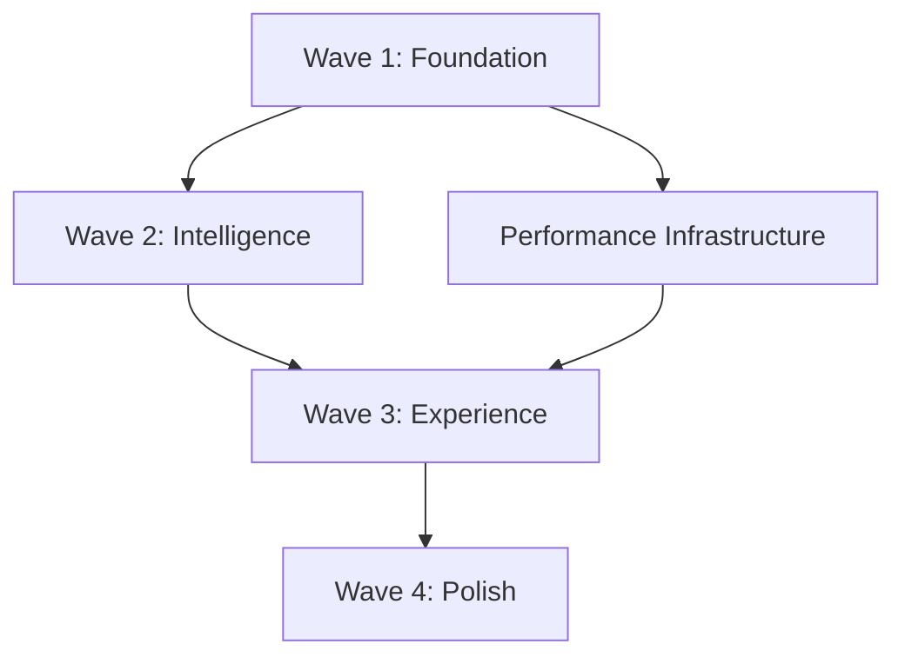

# Hierarchical Task Breakdown - Skelly-Jelly Next Stories

## Epic 1: Core System Integration 🎯

### Story 1.1: Event Bus Integration Testing (P0)

#### **Task 1.1.1: Module Registration Framework** 
*Estimated: 4 hours | Agent: Integration*
- **Subtask 1.1.1a**: Create module registration API
- **Subtask 1.1.1b**: Implement health check endpoints for all modules
- **Subtask 1.1.1c**: Add registration validation and error handling
- **Subtask 1.1.1d**: Test module discovery and lifecycle events

#### **Task 1.1.2: End-to-End Message Flow**
*Estimated: 6 hours | Agent: Integration*
- **Subtask 1.1.2a**: Implement DataCapture → Storage message flow
- **Subtask 1.1.2b**: Connect Storage → Analysis Engine pipeline
- **Subtask 1.1.2c**: Wire Analysis → Gamification → AI chain
- **Subtask 1.1.2d**: Complete AI → Figurine final connection
- **Subtask 1.1.2e**: Add end-to-end flow tracing and monitoring

#### **Task 1.1.3: Performance Validation**
*Estimated: 3 hours | Agent: Performance*
- **Subtask 1.1.3a**: Load test 1000+ msg/sec throughput
- **Subtask 1.1.3b**: Latency testing for <1ms target
- **Subtask 1.1.3c**: Memory usage profiling under load
- **Subtask 1.1.3d**: CPU usage validation during peak traffic

#### **Task 1.1.4: Failure Handling**
*Estimated: 5 hours | Agent: QA*
- **Subtask 1.1.4a**: Test module crash recovery
- **Subtask 1.1.4b**: Message delivery failure scenarios
- **Subtask 1.1.4c**: Network partition simulation
- **Subtask 1.1.4d**: Resource exhaustion recovery

---

### Story 1.2: System Orchestration (P0)

#### **Task 1.2.1: Startup Sequencing**
*Estimated: 4 hours | Agent: Integration*
- **Subtask 1.2.1a**: Implement dependency-ordered startup
- **Subtask 1.2.1b**: Add startup timeout and failure handling
- **Subtask 1.2.1c**: Create startup progress monitoring
- **Subtask 1.2.1d**: Validate <10 second startup target

#### **Task 1.2.2: Health Monitoring System**
*Estimated: 5 hours | Agent: Performance*
- **Subtask 1.2.2a**: Implement periodic health checks
- **Subtask 1.2.2b**: Create health metrics aggregation
- **Subtask 1.2.2c**: Add degraded state detection
- **Subtask 1.2.2d**: Implement alerting and notifications

#### **Task 1.2.3: Auto-Recovery Mechanisms**
*Estimated: 6 hours | Agent: Integration*
- **Subtask 1.2.3a**: Design recovery strategies per module type
- **Subtask 1.2.3b**: Implement exponential backoff restart logic
- **Subtask 1.2.3c**: Add circuit breaker for failing modules
- **Subtask 1.2.3d**: Create manual override capabilities

#### **Task 1.2.4: Configuration Hot-Reloading**
*Estimated: 4 hours | Agent: Integration*  
- **Subtask 1.2.4a**: Implement configuration change detection
- **Subtask 1.2.4b**: Add module-specific config reload handlers
- **Subtask 1.2.4c**: Create config validation before reload
- **Subtask 1.2.4d**: Test config rollback on failure

---

## Epic 2: ADHD State Detection 🧠

### Story 2.1: ML Model Implementation (P1)

#### **Task 2.1.1: Feature Extraction Pipeline**
*Estimated: 8 hours | Agent: ML*
- **Subtask 2.1.1a**: Implement keystroke dynamics features (IKI, dwell time)
- **Subtask 2.1.1b**: Add window switching pattern analysis
- **Subtask 2.1.1c**: Create mouse movement behavior metrics
- **Subtask 2.1.1d**: Implement sliding window feature aggregation
- **Subtask 2.1.1e**: Add feature normalization and scaling

#### **Task 2.1.2: Random Forest Classifier**
*Estimated: 6 hours | Agent: ML*
- **Subtask 2.1.2a**: Implement Random Forest training pipeline
- **Subtask 2.1.2b**: Add cross-validation and hyperparameter tuning
- **Subtask 2.1.2c**: Create model persistence and loading
- **Subtask 2.1.2d**: Implement real-time inference engine

#### **Task 2.1.3: State Classification Logic**
*Estimated: 4 hours | Agent: ML*
- **Subtask 2.1.3a**: Define state transition rules
- **Subtask 2.1.3b**: Implement confidence scoring
- **Subtask 2.1.3c**: Add temporal smoothing for stability
- **Subtask 2.1.3d**: Create state change event publishing

#### **Task 2.1.4: Online Learning System**
*Estimated: 5 hours | Agent: ML*
- **Subtask 2.1.4a**: Implement user feedback collection
- **Subtask 2.1.4b**: Add incremental model updates
- **Subtask 2.1.4c**: Create model drift detection
- **Subtask 2.1.4d**: Implement personalization features

---

### Story 2.2: Privacy-Preserving Analytics (P1)

#### **Task 2.2.1: Screenshot Lifecycle Management**
*Estimated: 4 hours | Agent: Security*
- **Subtask 2.2.1a**: Implement 30-second deletion timer
- **Subtask 2.2.1b**: Add secure deletion (overwrite memory)
- **Subtask 2.2.1c**: Create metadata extraction before deletion
- **Subtask 2.2.1d**: Add cleanup verification and auditing

#### **Task 2.2.2: PII Masking System**
*Estimated: 6 hours | Agent: Security*
- **Subtask 2.2.2a**: Implement regex-based PII detection
- **Subtask 2.2.2b**: Add ML-based sensitive content detection
- **Subtask 2.2.2c**: Create real-time text masking
- **Subtask 2.2.2d**: Add user-configurable sensitivity levels

#### **Task 2.2.3: Local ML Inference**
*Estimated: 3 hours | Agent: ML*
- **Subtask 2.2.3a**: Ensure no external API calls during inference
- **Subtask 2.2.3b**: Add model validation checksums
- **Subtask 2.2.3c**: Implement inference result encryption
- **Subtask 2.2.3d**: Create air-gapped mode for maximum privacy

#### **Task 2.2.4: Data Controls Interface**
*Estimated: 4 hours | Agent: UX*
- **Subtask 2.2.4a**: Create data export functionality
- **Subtask 2.2.4b**: Implement selective data deletion
- **Subtask 2.2.4c**: Add privacy dashboard with usage stats
- **Subtask 2.2.4d**: Create data retention policy controls

---

## Epic 3: Companion Interaction 🎭

### Story 3.1: Contextual Interventions (P2)

#### **Task 3.1.1: Work-Type Detection**
*Estimated: 5 hours | Agent: ML*
- **Subtask 3.1.1a**: Implement application-based detection
- **Subtask 3.1.1b**: Add file extension analysis
- **Subtask 3.1.1c**: Create behavior pattern recognition
- **Subtask 3.1.1d**: Add confidence scoring for work type

#### **Task 3.1.2: Intervention Timing Logic**
*Estimated: 4 hours | Agent: UX*
- **Subtask 3.1.2a**: Implement 15-minute cooldown system
- **Subtask 3.1.2b**: Add flow state detection and blocking
- **Subtask 3.1.2c**: Create user preference learning
- **Subtask 3.1.2d**: Add manual intervention controls

#### **Task 3.1.3: Context-Aware Messaging**
*Estimated: 6 hours | Agent: UX*
- **Subtask 3.1.3a**: Create coding-specific intervention messages
- **Subtask 3.1.3b**: Add writing assistance prompts
- **Subtask 3.1.3c**: Implement design workflow suggestions
- **Subtask 3.1.3d**: Create generic productivity tips

#### **Task 3.1.4: Feedback Collection**
*Estimated: 3 hours | Agent: UX*
- **Subtask 3.1.4a**: Add intervention helpfulness rating
- **Subtask 3.1.4b**: Implement timing preference feedback
- **Subtask 3.1.4c**: Create suggestion improvement system
- **Subtask 3.1.4d**: Add feedback analytics and learning

---

## Epic 4: Performance & Reliability ⚡

### Story 4.1: Resource Management (P1)

#### **Task 4.1.1: CPU Usage Optimization**
*Estimated: 4 hours | Agent: Performance*
- **Subtask 4.1.1a**: Profile CPU hotspots across modules
- **Subtask 4.1.1b**: Optimize event processing loops
- **Subtask 4.1.1c**: Implement adaptive sampling rates
- **Subtask 4.1.1d**: Add CPU usage monitoring and throttling

#### **Task 4.1.2: Memory Management**
*Estimated: 5 hours | Agent: Performance*
- **Subtask 4.1.2a**: Implement memory pooling for events
- **Subtask 4.1.2b**: Add garbage collection optimization
- **Subtask 4.1.2c**: Create memory leak detection
- **Subtask 4.1.2d**: Implement memory pressure handling

#### **Task 4.1.3: Battery Optimization**
*Estimated: 3 hours | Agent: Performance*
- **Subtask 4.1.3a**: Reduce background processing frequency
- **Subtask 4.1.3b**: Optimize system hook efficiency
- **Subtask 4.1.3c**: Add power state awareness
- **Subtask 4.1.3d**: Create battery usage monitoring

---

## Delegation Matrix

| Agent | Primary Focus | Secondary | Dependencies |
|-------|---------------|-----------|--------------|
| **Integration** | System connection, Event Bus | Module coordination | None |
| **ML** | ADHD detection, feature extraction | Privacy analytics | Integration |
| **UX** | Companion personality, interventions | User feedback | ML |
| **Performance** | Resource optimization, monitoring | Reliability | Integration |
| **Security** | Privacy protection, data lifecycle | Compliance | All |
| **QA** | Testing, validation, scenarios | Documentation | All |

## Wave Execution Dependencies

## Critical Path Analysis

**Critical Path:** Integration → ML → UX (18 days)
**Risk Factors:**
- Event Bus stability (affects all downstream work)
- ML model accuracy (affects user experience)
- Performance targets (affects production readiness)

**Mitigation Strategies:**
- Parallel development where possible
- Early integration testing
- Performance benchmarking throughout
- Regular cross-agent coordination checkpoints