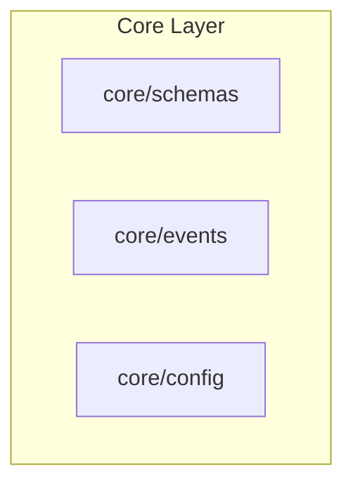
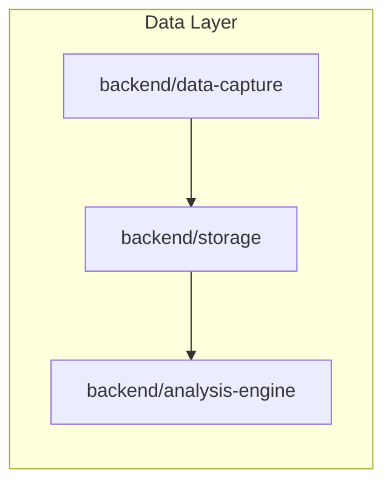
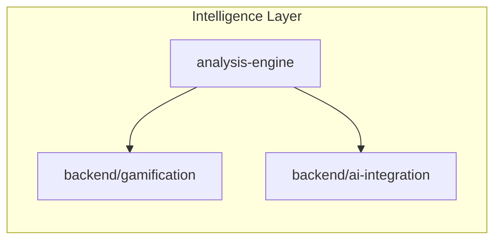
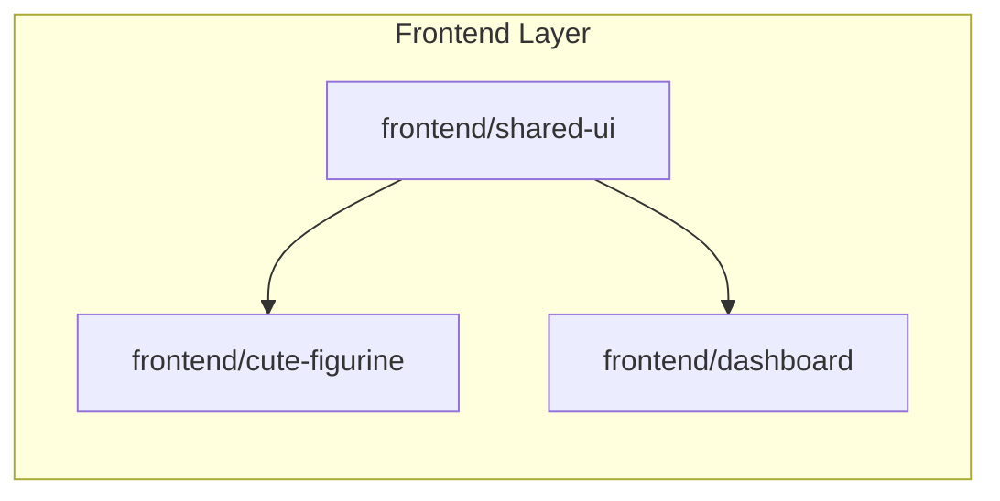
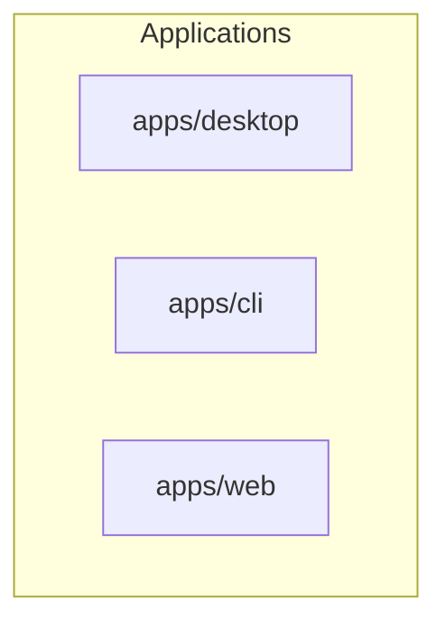

# Skelly-Jelly Monorepo Architecture

## Overview

This document defines the architectural blueprint for organizing the Skelly-Jelly project as a multi-language monorepo with clear module boundaries, dependency management, and development workflows.

## Current State Analysis

### Existing Structure
- **Root**: Python project with minimal dependencies
- **Modules**: Single `cute-figurine` React/TypeScript module
- **Documentation**: Comprehensive design docs in `/docs/`
- **Missing**: Core backend modules (data-capture, storage, analysis-engine, etc.)

### Technology Stack
- **Frontend**: React 18, TypeScript, Three.js, Zustand
- **Backend**: Python 3.13+, planned Rust components
- **Bundling**: Vite for frontend, uv for Python
- **Target Platform**: Tauri desktop application

## Recommended Architecture

### Directory Structure

```
skelly-jelly/
├── package.json                 # Root workspace configuration
├── pyproject.toml              # Python project coordination
├── uv.lock                     # Python dependency lock
├── README.md                   # Project overview
├── docs/                       # Project documentation
│   ├── MONOREPO_ARCHITECTURE.md  # This document
│   ├── skelly-jelly-hld.md     # High-level design
│   └── API_REFERENCE.md        # API documentation
├── modules/                    # Feature modules
│   ├── core/                   # Shared infrastructure
│   │   ├── schemas/            # Cross-language type definitions
│   │   ├── events/             # Event bus specification
│   │   └── config/             # Shared configuration
│   ├── backend/                # Python/Rust modules
│   │   ├── data-capture/       # System monitoring (Rust)
│   │   ├── storage/            # Event persistence (Python)
│   │   ├── analysis-engine/    # ADHD detection (Python/ONNX)
│   │   ├── ai-integration/     # LLM assistance (Python)
│   │   └── gamification/       # Reward system (Python)
│   └── frontend/               # TypeScript/React modules
│       ├── cute-figurine/      # ✅ Visual companion (existing)
│       ├── dashboard/          # Admin interface
│       └── shared-ui/          # Common components
└── apps/                       # Application bundles
    ├── desktop/                # Tauri application
    ├── cli/                    # Development CLI
    └── web/                    # Development dashboard
```

### Module Layering

#### Layer 1: Core Infrastructure


**Responsibilities**:
- `core/schemas`: TypeScript/Python type definitions, JSON schemas
- `core/events`: Event bus specification, message contracts
- `core/config`: Environment configuration, feature flags

#### Layer 2: Data Pipeline


**Event Flow**:
- `data-capture` → `RawEvent` → `storage`
- `storage` → `EventBatch` → `analysis-engine`
- `analysis-engine` → `StateClassification` → upper layers

#### Layer 3: Intelligence Layer


**Responsibilities**:
- `gamification`: Reward calculation, intervention timing
- `ai-integration`: Context-aware assistance, LLM integration

#### Layer 4: Presentation Layer


**Components**:
- `cute-figurine`: WebGL companion, animation engine
- `dashboard`: User preferences, analytics view
- `shared-ui`: Common React components

#### Layer 5: Application Layer


**Bundles**:
- `apps/desktop`: Tauri application (production)
- `apps/cli`: Development tools, debugging
- `apps/web`: Admin interface, configuration

## Dependency Management

### Package Managers by Layer

**Root Coordination**:
```json
{
  "workspaces": [
    "modules/frontend/*",
    "modules/core/*",
    "apps/*"
  ]
}
```

**Frontend Modules** (`npm`):
- React, TypeScript, Three.js ecosystem
- Vite for bundling, Vitest for testing
- Shared dependencies hoisted to workspace root

**Backend Modules** (`uv`):
- Python packages with isolated environments
- Rust integration via PyO3 where needed
- ONNX Runtime for ML inference

**Core Modules** (Mixed):
- Schema generation tools (TypeScript ↔ Python)
- Configuration management utilities

### Dependency Boundaries

**Allowed Dependencies**:
```
frontend/* → core/schemas, core/events
backend/* → core/schemas, core/events, core/config
apps/* → any modules (application bundles)
```

**Prohibited Dependencies**:
```
core/* → any modules (must remain pure)
frontend/* → backend/* (maintain separation)
```

## Build & Development Workflow

### Root Package Scripts

```json
{
  "scripts": {
    "dev": "concurrently \"npm run dev:frontend\" \"uv run dev:backend\"",
    "build": "npm run build:core && npm run build:frontend && uv run build:backend",
    "test": "npm run test:frontend && uv run test:backend",
    "lint": "npm run lint:frontend && uv run lint:backend",
    "type-check": "npm run type-check:frontend && uv run type-check:backend"
  }
}
```

### Module Development

**Frontend Development**:
```bash
# Individual module development
cd modules/frontend/cute-figurine
npm run dev

# Storybook for component development
npm run storybook
```

**Backend Development**:
```bash
# Python module development
cd modules/backend/analysis-engine
uv run python -m pytest

# Performance profiling
uv run python -m cProfile main.py
```

### Cross-Language Integration

**Type Generation**:
- JSON Schema → TypeScript interfaces
- Python dataclasses → TypeScript types
- Automated via build pipeline

**Event Bus**:
- WebSocket/IPC communication
- Type-safe message passing
- Error handling and retry logic

## Performance Considerations

### Module Loading
- **Lazy Loading**: Frontend modules loaded on demand
- **Tree Shaking**: Unused code elimination
- **Code Splitting**: Route-based and feature-based

### Resource Management
- **Memory Isolation**: Separate processes for data capture
- **CPU Budgets**: <2% total system usage target
- **Disk Usage**: Configurable retention policies

### Development Performance
- **Incremental Builds**: Only changed modules rebuild
- **Parallel Testing**: Independent test suites
- **Hot Reloading**: Frontend development efficiency

## Security & Privacy

### Module Isolation
- **Principle of Least Privilege**: Minimal permissions per module
- **Sandboxing**: Data capture runs in restricted environment
- **API Boundaries**: Clear security interfaces

### Data Flow Security
- **Local Processing**: No external API dependencies for core features
- **Encryption**: Sensitive data encrypted at rest
- **Access Control**: Module-based permission system

## Migration Strategy

### Phase 1: Workspace Setup
1. Create root `package.json` with workspaces
2. Move `cute-figurine` to `modules/frontend/`
3. Setup core infrastructure modules

### Phase 2: Backend Modules
1. Implement `core/schemas` with type generation
2. Create `backend/data-capture` (Rust)
3. Implement `backend/storage` (Python)

### Phase 3: Intelligence Layer
1. `backend/analysis-engine` with ML pipeline
2. `backend/ai-integration` with LLM support
3. `backend/gamification` with reward system

### Phase 4: Applications
1. `apps/desktop` Tauri integration
2. `apps/cli` development tools
3. `apps/web` admin interface

### Phase 5: Optimization
1. Performance profiling and optimization
2. Bundle size optimization
3. Memory usage optimization

## Maintenance Guidelines

### Version Management
- **Semantic Versioning**: All modules follow semver
- **Lockfile Management**: Coordinated dependency updates
- **Breaking Changes**: Clear migration guides

### Documentation
- **README per Module**: Setup and usage instructions
- **API Documentation**: Auto-generated from code
- **Architecture Decisions**: Document design choices

### Quality Assurance
- **Automated Testing**: Unit, integration, and E2E tests
- **Code Quality**: Linting, formatting, type checking
- **Performance Monitoring**: Continuous performance regression detection

---

This architecture provides a scalable foundation for the Skelly-Jelly project while maintaining clear boundaries, enabling independent development, and supporting the ambitious performance and privacy goals.