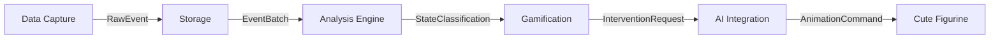

# Skelly-Jelly Project Index

## 🎯 Project Overview

**Skelly-Jelly** is a neurodiversity-affirming ADHD focus assistant featuring a melty skeleton companion that provides ambient support without disrupting focus states. The system uses software-only monitoring to detect ADHD states and provide gentle, gamified interventions with context-aware work assistance.

### Key Features
- 🦴 Melty skeleton companion with ambient animations
- 🧠 Real-time ADHD state detection using behavioral patterns
- 🎮 Non-intrusive gamification with variable rewards
- 💡 Context-aware work assistance (coding, writing, design)
- 🔒 Privacy-first local processing
- ⚡ <2% CPU overhead performance target

## 📁 Project Structure

```
skelly-jelly/
├── README.md                    # Project introduction
├── pyproject.toml              # Python project configuration
├── uv.lock                     # Dependency lock file
├── main.py                     # Entry point
├── docs/
│   ├── skelly-jelly-hld.md    # High-level design document
│   ├── skelly-jelly-schema.md # Data schemas and interfaces
│   └── PROJECT_INDEX.md        # This file
└── modules/                    # Core modules (to be created)
    ├── data-capture/           # System monitoring
    ├── storage/                # Event storage & batching
    ├── analysis-engine/        # ADHD state detection
    ├── gamification/           # Reward system
    ├── ai-integration/         # LLM assistance
    └── cute-figurine/          # Visual companion
```

## 🏗️ Architecture Overview

### Layer Architecture
1. **Gamification Layer** - Non-intrusive reward system
2. **Optimization Layer** - Performance-critical processing
3. **Cute Figurine Layer** - Visual representation
4. **Data Storage/Transfer Layer** - High-performance data pipeline
5. **Data Capture Layer** - Non-invasive system monitoring
6. **Analysis Engine** - Real-time behavioral analysis
7. **AI Integration Layer** - Context-aware assistance

### Module Ownership & Event Flow



## 📊 Core Data Schemas

### Event Types
- **KeystrokeEvent** - Typing patterns and rhythm
- **MouseEvent** - Movement velocity and clicks
- **WindowEvent** - App focus and context switches
- **ScreenshotEvent** - Visual context metadata
- **ResourceEvent** - CPU/memory usage

### ADHD States
- **Flow** - Optimal productive state
- **Hyperfocus** - Extended deep focus
- **Productive Switching** - Healthy task rotation
- **Distracted** - Attention fragmentation
- **Perseveration** - Stuck on unproductive task
- **Idle/Break** - Rest periods

### Intervention Types
- **Gentle Nudge** - Subtle awareness prompts
- **Break Suggestion** - Rest recommendations
- **Helpful Tip** - Context-aware assistance
- **Celebration** - Achievement recognition
- **Context Switch Warning** - Transition support
- **Hyperfocus Check** - Time awareness

## 🚀 Implementation Roadmap

### Phase 1: Core Infrastructure (Current)
- [x] Project setup with uv/pyproject.toml
- [x] Architecture documentation
- [x] Data schema definitions
- [ ] Event bus implementation
- [ ] Basic module structure

### Phase 2: MVP Features
- [ ] Cute figurine with basic animations
- [ ] Simple keystroke/mouse monitoring
- [ ] Basic ADHD state detection
- [ ] Minimal intervention system

### Phase 3: Full Features
- [ ] Complete data capture suite
- [ ] ML-based state classification
- [ ] Gamification mechanics
- [ ] AI-powered suggestions
- [ ] Screenshot analysis

### Phase 4: Polish & Launch
- [ ] Performance optimization
- [ ] Cross-platform testing
- [ ] Community beta testing
- [ ] Public release

## 🛠️ Technical Stack

### Core Technologies
- **Framework**: Tauri (Rust + WebView)
- **Primary Languages**: Rust (performance) + TypeScript (UI)
- **Animation**: WebGL with Three.js/Pixi.js
- **ML Runtime**: ONNX Runtime with CoreML
- **LLM**: llama.cpp with Metal support
- **Database**: SQLite with time-series extensions
- **Build System**: Nix + Bazel

### Performance Targets
- **CPU Usage**: <2% average on M3 Pro
- **Memory**: <170MB (Tauri baseline)
- **Latency**: <50ms for interventions
- **Event Loss**: <0.1%
- **Startup Time**: ~2 seconds

## 🔒 Privacy & Security

### Core Principles
- **Local-only processing** - No cloud dependencies
- **Encryption available** - Optional AES-256
- **PII masking** - Automatic sensitive data protection
- **User control** - Complete data ownership
- **Screenshot lifecycle** - Temporary storage with auto-deletion

### Compliance Considerations
- GDPR-ready with full data portability
- HIPAA-compatible encryption options
- Workplace privacy controls

## 🧪 Testing Strategy

### Test Architecture
- **Unit tests** - Per module coverage
- **Integration tests** - Cross-module contracts
- **Smoke tests** - Full system validation
- **Performance benchmarks** - Critical path optimization
- **User studies** - ADHD community feedback

### AI-Optimized Testing
- Structured JSON output format
- Deterministic test ordering
- Contract-based boundaries
- FastMCP for test automation

## 📖 Key Documentation

### Design Documents
- [High-Level Design](skelly-jelly-hld.md) - Complete system architecture
- [Data Schemas](skelly-jelly-schema.md) - TypeScript interface definitions

### Module Documentation
Each module will contain:
- `README.md` - Module purpose and API
- `BUILD.bazel` - Build configuration
- `src/` - Implementation code
- `tests/` - Module-specific tests

## 🎯 Design Philosophy

### User Experience
- **Non-intrusive** - Ambient support, not disruption
- **ADHD-affirming** - Celebrates neurodiversity
- **Genuinely helpful** - Real work assistance
- **Privacy-first** - Local processing only
- **Customizable** - Adapts to individual needs

### Technical Excellence
- **Performance-critical** - <2% CPU overhead
- **Cross-platform** - macOS, Windows, Linux
- **Reproducible builds** - Nix + Bazel
- **AI-friendly** - Structured for LLM assistance
- **Open architecture** - Clear module boundaries

## 🚦 Getting Started

### Prerequisites
- Python 3.13+
- uv package manager
- Git

### Setup
```bash
# Clone repository
git clone <repository-url>
cd skelly-jelly

# Install dependencies
uv sync

# Run main entry point
uv run python main.py
```

### Development
```bash
# Future commands (via Justfile)
just build      # Build all modules
just test       # Run all tests
just run        # Development mode
just test-watch # Continuous testing
```

## 📝 Contributing

### Code Style
- **Rust**: snake_case, rustfmt
- **TypeScript**: camelCase, prettier
- **Directories**: kebab-case
- **Documentation**: Markdown

### Module Guidelines
- Clear ownership boundaries
- Event-driven communication
- Comprehensive testing
- Performance awareness

---

*"A better Clippy" - but one that actually helps, respects your focus, and makes work a little less overwhelming for ADHD brains.*