# Skelly-Jelly Architecture Diagram

## System Overview

```mermaid
graph TB
    subgraph "User Interface Layer"
        CF[Cute Figurine<br/>💀 WebGL Skeleton]
        UI[System Tray<br/>Settings UI]
    end
    
    subgraph "Application Layer"
        GM[Gamification Module<br/>🎮 TypeScript]
        AI[AI Integration<br/>🤖 Rust + LLM]
    end
    
    subgraph "Analysis Layer"
        AE[Analysis Engine<br/>🧠 Rust + ONNX]
    end
    
    subgraph "Data Layer"
        DC[Data Capture<br/>📊 Rust]
        ST[Storage Module<br/>💾 SQLite]
    end
    
    subgraph "Infrastructure Layer"
        EB[Event Bus<br/>🚌 Rust]
        OR[Orchestrator<br/>🎭 Rust]
    end
    
    %% User interactions
    User((User)) --> CF
    User --> DC
    
    %% Data flow
    DC -->|RawEvent| EB
    EB -->|RawEvent| ST
    ST -->|EventBatch| EB
    EB -->|EventBatch| AE
    AE -->|StateChange| EB
    EB -->|StateChange| GM
    GM -->|InterventionRequest| EB
    EB -->|InterventionRequest| AI
    AI -->|AnimationCommand| EB
    EB -->|AnimationCommand| CF
    AI -->|InterventionResponse| EB
    EB -->|InterventionResponse| GM
    
    %% Control flow
    OR -.->|Health Check| EB
    OR -.->|Config Update| EB
    EB -.->|Status| OR
    
    %% UI updates
    GM -->|Progress Update| UI
    CF -->|User Interaction| EB
    
    style CF fill:#f9f,stroke:#333,stroke-width:4px
    style EB fill:#bbf,stroke:#333,stroke-width:4px
    style AE fill:#bfb,stroke:#333,stroke-width:4px
```

## Data Flow Sequence

## Module Communication Matrix

| Module | Publishes | Subscribes To | Primary Language |
|--------|-----------|---------------|------------------|
| Data Capture | `RawEvent` | `ConfigUpdate`, `Shutdown` | Rust |
| Storage | `EventBatch` | `RawEvent`, `ConfigUpdate` | Rust |
| Analysis Engine | `StateChange`, `AnalysisComplete` | `EventBatch`, `ConfigUpdate` | Rust |
| Gamification | `InterventionRequest`, `RewardEvent` | `StateChange`, `InterventionResponse` | TypeScript |
| AI Integration | `InterventionResponse`, `AnimationCommand` | `InterventionRequest` | Rust |
| Cute Figurine | `UserInteraction` | `AnimationCommand`, `RewardEvent` | TypeScript |
| Orchestrator | `HealthCheck`, `ConfigUpdate` | `HealthStatus`, `ModuleError` | Rust |

## Performance Characteristics

## Resource Allocation

## Security & Privacy Architecture

This architecture ensures:
- **Privacy**: All data processing happens locally by default
- **Performance**: Event-driven architecture with intelligent batching
- **Modularity**: Each component can be developed and tested independently
- **Reliability**: Orchestrator monitors health and manages recovery
- **User Experience**: Non-intrusive interventions that respect flow states