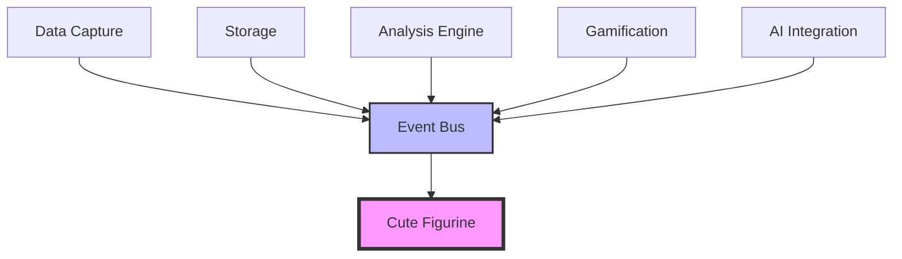

# Cute Figurine Integration Guide

## Overview

This document details how the Cute Figurine module integrates with other Skelly-Jelly modules through the event bus architecture. The figurine acts as a read-only consumer of system events, displaying visual feedback based on user states and system activities.

## Integration Architecture

### Module Communication Flow



### Event Bus Integration

The Cute Figurine module subscribes to specific event types and responds with appropriate animations and visual feedback:

```typescript
// Event subscription setup
class CuteFigurineEventHandler {
  private eventBus: EventBus;
  private animationController: AnimationController;
  private stateManager: StateManager;
  
  constructor(eventBus: EventBus) {
    this.eventBus = eventBus;
    this.subscribeToEvents();
  }
  
  private subscribeToEvents() {
    // Animation commands from AI/Gamification
    this.eventBus.subscribe('AnimationCommand', this.handleAnimationCommand.bind(this));
    
    // State changes from Analysis Engine
    this.eventBus.subscribe('StateClassification', this.handleStateChange.bind(this));
    
    // Intervention requests from Gamification
    this.eventBus.subscribe('InterventionRequest', this.handleIntervention.bind(this));
    
    // Reward notifications from Gamification
    this.eventBus.subscribe('RewardEarned', this.handleReward.bind(this));
    
    // System events
    this.eventBus.subscribe('SystemShutdown', this.handleShutdown.bind(this));
  }
}
```

## Integration Points by Module

### 1. Analysis Engine Integration

The Analysis Engine sends ADHD state classifications that drive companion mood and behavior:

```typescript
// Incoming event from Analysis Engine
interface StateClassificationEvent {
  type: 'StateClassification';
  payload: {
    state: 'focused' | 'distracted' | 'hyperfocus' | 'tired' | 'break';
    confidence: number; // 0-1
    metrics: {
      keystrokeVariability: number;
      windowSwitchRate: number;
      idleTime: number;
    };
    timestamp: number;
  };
}

// Handler in Cute Figurine
private handleStateChange(event: StateClassificationEvent) {
  const { state, confidence, metrics } = event.payload;
  
  // Update companion state based on ADHD state
  switch (state) {
    case 'focused':
      this.stateManager.updateMood(MoodState.FOCUSED);
      this.stateManager.updateEnergy(80);
      this.animationController.play('steady_breathing');
      break;
      
    case 'distracted':
      this.stateManager.updateMood(MoodState.THINKING);
      this.animationController.play('fidget_animation');
      break;
      
    case 'hyperfocus':
      this.stateManager.updateMood(MoodState.FOCUSED);
      this.stateManager.updateGlow(0.8);
      this.animationController.play('intense_focus_aura');
      break;
      
    case 'tired':
      this.stateManager.updateMood(MoodState.TIRED);
      this.stateManager.updateMeltLevel(30);
      this.animationController.play('slow_melt');
      break;
  }
}
```

### 2. Gamification Module Integration

The Gamification module sends intervention requests and reward notifications:

```typescript
// Intervention request from Gamification
interface InterventionRequestEvent {
  type: 'InterventionRequest';
  payload: {
    interventionType: 'break_reminder' | 'focus_help' | 'celebration' | 'encouragement';
    message: string;
    priority: 'low' | 'medium' | 'high';
    suggestedAnimation?: string;
    cooldownRemaining: number;
  };
}

// Handler
private handleIntervention(event: InterventionRequestEvent) {
  const { interventionType, message, priority, suggestedAnimation } = event.payload;
  
  // Check if we can intervene
  if (this.stateManager.canIntervene()) {
    // Queue the message
    this.messageQueue.add({
      text: message,
      duration: priority === 'high' ? 8000 : 5000,
      style: this.getMessageStyle(interventionType)
    });
    
    // Play appropriate animation
    const animation = suggestedAnimation || this.getDefaultAnimation(interventionType);
    this.animationController.play(animation);
    
    // Record intervention
    this.stateManager.recordIntervention();
  }
}

// Reward notification
interface RewardEarnedEvent {
  type: 'RewardEarned';
  payload: {
    rewardType: 'streak' | 'milestone' | 'achievement' | 'daily';
    value: number;
    message: string;
    celebrationLevel: 'small' | 'medium' | 'large';
  };
}

// Handler
private handleReward(event: RewardEarnedEvent) {
  const { celebrationLevel, message } = event.payload;
  
  // Update happiness
  this.stateManager.updateHappiness(
    this.stateManager.happiness + (celebrationLevel === 'large' ? 20 : 10)
  );
  
  // Play celebration animation
  const celebrationAnimations = {
    small: 'happy_wiggle',
    medium: 'jump_for_joy',
    large: 'epic_celebration'
  };
  
  this.animationController.play(celebrationAnimations[celebrationLevel]);
  
  // Show celebration particles
  this.particleSystem.emit('confetti', {
    count: celebrationLevel === 'large' ? 100 : 50,
    duration: 3000
  });
  
  // Display message
  this.messageQueue.add({
    text: message,
    duration: 6000,
    style: 'celebration'
  });
}
```

### 3. AI Integration Module

The AI Integration module sends context-aware animation commands and personality updates:

```typescript
// Animation command from AI
interface AnimationCommandEvent {
  type: 'AnimationCommand';
  payload: {
    command: 'play' | 'queue' | 'blend' | 'stop';
    animation?: string;
    parameters?: {
      mood?: MoodState;
      energy?: number;
      expression?: string;
      duration?: number;
    };
    message?: {
      text: string;
      personality: 'encouraging' | 'helpful' | 'celebratory' | 'gentle';
    };
  };
}

// Handler
private handleAnimationCommand(event: AnimationCommandEvent) {
  const { command, animation, parameters, message } = event.payload;
  
  switch (command) {
    case 'play':
      if (animation) {
        this.animationController.play(animation, {
          duration: parameters?.duration
        });
      }
      break;
      
    case 'blend':
      if (parameters?.mood) {
        this.stateManager.blendToMood(parameters.mood, 1000);
      }
      break;
      
    case 'queue':
      if (animation) {
        this.animationController.queue(animation);
      }
      break;
  }
  
  // Handle personality-driven message
  if (message) {
    this.displayPersonalityMessage(message.text, message.personality);
  }
}

// Work context updates
interface WorkContextEvent {
  type: 'WorkContext';
  payload: {
    activity: 'coding' | 'writing' | 'designing' | 'researching' | 'idle';
    language?: string;
    tool?: string;
    complexity?: 'low' | 'medium' | 'high';
  };
}

// Adjust companion behavior based on work context
private handleWorkContext(event: WorkContextEvent) {
  const { activity, complexity } = event.payload;
  
  // Adjust intervention frequency
  if (activity === 'coding' && complexity === 'high') {
    this.stateManager.setInterventionCooldown(1800); // 30 min for complex work
  }
  
  // Set appropriate idle animations
  this.animationController.setIdleSet(
    this.getIdleAnimationsForActivity(activity)
  );
}
```

### 4. Data Capture Module Integration

While the Cute Figurine doesn't receive events directly from Data Capture, it can respond to user interactions that are then captured:

```typescript
// User interaction handling
class InteractionHandler {
  private eventBus: EventBus;
  
  handlePet(event: MouseEvent) {
    // Play pet response animation
    this.animationController.play('happy_pet_response');
    
    // The Data Capture module will capture this interaction
    // No need to emit events - Data Capture monitors all interactions
  }
  
  handleDrag(event: DragEvent) {
    // Update position
    this.stateManager.updatePosition({
      x: event.clientX,
      y: event.clientY
    });
    
    // Save position preference
    this.savePositionPreference();
  }
}
```

### 5. Storage Module Integration

The Cute Figurine module uses local storage for preferences but doesn't interact with the main Storage module:

```typescript
// Local preference storage
class PreferenceStorage {
  private readonly STORAGE_KEY = 'skelly-companion-prefs';
  
  savePreferences(prefs: CompanionPreferences) {
    const data: CompanionPreferences = {
      position: prefs.position,
      transparency: prefs.transparency,
      animationQuality: prefs.animationQuality,
      reducedMotion: prefs.reducedMotion,
      scale: prefs.scale
    };
    
    localStorage.setItem(this.STORAGE_KEY, JSON.stringify(data));
  }
  
  loadPreferences(): CompanionPreferences | null {
    const stored = localStorage.getItem(this.STORAGE_KEY);
    return stored ? JSON.parse(stored) : null;
  }
}
```

## Message Queue System

The message queue handles all text bubble displays with priority and cooldown management:

```typescript
class MessageQueueSystem {
  private queue: PriorityQueue<QueuedMessage> = new PriorityQueue();
  private currentMessage: QueuedMessage | null = null;
  private displayTimer: number | null = null;
  
  add(message: Message, priority: number = 5) {
    const queuedMessage: QueuedMessage = {
      ...message,
      priority,
      timestamp: Date.now()
    };
    
    this.queue.enqueue(queuedMessage, priority);
    
    if (!this.currentMessage) {
      this.displayNext();
    }
  }
  
  private displayNext() {
    if (this.queue.isEmpty()) {
      this.currentMessage = null;
      return;
    }
    
    this.currentMessage = this.queue.dequeue();
    
    // Show message with fade-in
    this.textBubble.show(this.currentMessage, {
      fadeIn: 200,
      fadeOut: 300
    });
    
    // Set timer for next message
    this.displayTimer = window.setTimeout(() => {
      this.textBubble.hide();
      setTimeout(() => this.displayNext(), 500);
    }, this.currentMessage.duration);
  }
  
  clear() {
    this.queue.clear();
    if (this.displayTimer) {
      clearTimeout(this.displayTimer);
    }
    this.textBubble.hide();
    this.currentMessage = null;
  }
}
```

## Performance Considerations

### Event Handling Optimization

```typescript
class OptimizedEventHandler {
  private eventBuffer: Map<string, Event[]> = new Map();
  private processInterval: number;
  
  constructor() {
    // Process events in batches every 100ms
    this.processInterval = window.setInterval(() => {
      this.processBatchedEvents();
    }, 100);
  }
  
  handleEvent(event: Event) {
    const eventType = event.type;
    
    if (!this.eventBuffer.has(eventType)) {
      this.eventBuffer.set(eventType, []);
    }
    
    this.eventBuffer.get(eventType)!.push(event);
  }
  
  private processBatchedEvents() {
    for (const [eventType, events] of this.eventBuffer) {
      if (events.length === 0) continue;
      
      // Process based on event type
      switch (eventType) {
        case 'StateClassification':
          // Only process the latest state
          this.processStateChange(events[events.length - 1]);
          break;
          
        case 'AnimationCommand':
          // Process all animation commands in order
          events.forEach(event => this.processAnimationCommand(event));
          break;
          
        case 'RewardEarned':
          // Combine multiple rewards into one celebration
          this.processCombinedRewards(events);
          break;
      }
      
      // Clear processed events
      events.length = 0;
    }
  }
}
```

### Resource Management

```typescript
class ResourceManager {
  private readonly MAX_PARTICLES = 100;
  private readonly MAX_CONCURRENT_ANIMATIONS = 3;
  private readonly TEXTURE_CACHE_SIZE = 20;
  
  private textureCache: LRUCache<string, Texture>;
  private activeAnimations: Set<Animation> = new Set();
  private particlePool: ParticlePool;
  
  canPlayAnimation(): boolean {
    return this.activeAnimations.size < this.MAX_CONCURRENT_ANIMATIONS;
  }
  
  canEmitParticles(count: number): boolean {
    return this.particlePool.available() >= count;
  }
  
  optimizeForLowPerformance() {
    // Reduce animation quality
    this.animationController.setQuality('low');
    
    // Disable particles
    this.particleSystem.disable();
    
    // Reduce texture resolution
    this.textureCache.forEach(texture => {
      texture.setResolution(256);
    });
    
    // Simplify shaders
    this.shaderManager.useSimpleShaders();
  }
}
```

## Error Handling and Recovery

```typescript
class ErrorBoundary {
  private fallbackMode: boolean = false;
  
  handleError(error: Error, context: string) {
    console.error(`Cute Figurine Error in ${context}:`, error);
    
    // Log to telemetry if available
    this.logError(error, context);
    
    // Attempt recovery
    switch (context) {
      case 'animation':
        this.recoverAnimation();
        break;
      case 'rendering':
        this.recoverRendering();
        break;
      case 'eventHandling':
        this.recoverEventHandling();
        break;
      default:
        this.enterFallbackMode();
    }
  }
  
  private recoverAnimation() {
    // Reset to safe idle animation
    this.animationController.reset();
    this.animationController.play('idle_breathing');
  }
  
  private recoverRendering() {
    // Switch to canvas 2D fallback
    this.renderer.switchToCanvas2D();
  }
  
  private enterFallbackMode() {
    this.fallbackMode = true;
    
    // Show static image instead of animated companion
    this.showStaticCompanion();
    
    // Disable non-essential features
    this.particleSystem.disable();
    this.shaderManager.disable();
  }
}
```

## Testing Integration Points

```typescript
// Integration test example
describe('Cute Figurine Integration', () => {
  let eventBus: EventBus;
  let cuteFigurine: CuteFigurineModule;
  
  beforeEach(() => {
    eventBus = new EventBus();
    cuteFigurine = new CuteFigurineModule(eventBus);
  });
  
  it('should respond to state classification events', async () => {
    const stateEvent: StateClassificationEvent = {
      type: 'StateClassification',
      payload: {
        state: 'focused',
        confidence: 0.9,
        metrics: {
          keystrokeVariability: 0.2,
          windowSwitchRate: 0.1,
          idleTime: 0
        },
        timestamp: Date.now()
      }
    };
    
    eventBus.emit('StateClassification', stateEvent);
    
    await waitFor(() => {
      expect(cuteFigurine.getCurrentMood()).toBe('focused');
      expect(cuteFigurine.getCurrentAnimation()).toBe('steady_breathing');
    });
  });
  
  it('should handle intervention requests with cooldown', async () => {
    const interventionEvent: InterventionRequestEvent = {
      type: 'InterventionRequest',
      payload: {
        interventionType: 'break_reminder',
        message: 'Time for a stretch!',
        priority: 'medium',
        cooldownRemaining: 0
      }
    };
    
    eventBus.emit('InterventionRequest', interventionEvent);
    
    // First intervention should work
    expect(cuteFigurine.isDisplayingMessage()).toBe(true);
    
    // Second intervention should be blocked by cooldown
    eventBus.emit('InterventionRequest', interventionEvent);
    expect(cuteFigurine.getInterventionCooldown()).toBeGreaterThan(0);
  });
});
```

## Summary

The Cute Figurine module integrates seamlessly with the Skelly-Jelly ecosystem through:

1. **Event-Driven Architecture**: Clean separation of concerns with no direct dependencies
2. **Read-Only Design**: Consumes events but doesn't produce them (except for telemetry)
3. **Performance Optimization**: Batched event processing and resource management
4. **Graceful Degradation**: Fallback modes for low-performance scenarios
5. **Comprehensive Error Handling**: Recovery strategies for all integration points

This architecture ensures the companion remains responsive and delightful while maintaining the strict performance requirements of <2% CPU usage and <170MB memory footprint.