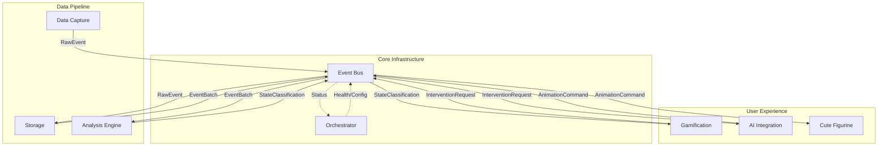
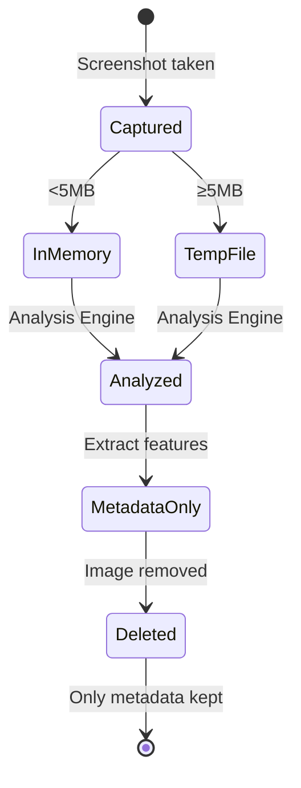

# Skelly-Jelly High-Level Design Document (HLD)

## Overview
Skelly-Jelly is a neurodiversity-affirming ADHD focus assistant featuring a melty skeleton companion that provides ambient support without disrupting focus states. The system uses software-only monitoring to detect ADHD states and provide gentle, gamified interventions with context-aware work assistance.

## System Architecture & Module Overview

### Core Infrastructure Modules

#### Event Bus Module
- **Purpose:** High-performance message broker for all inter-module communication
- **Capabilities:** 
  - 1000+ messages/second throughput
  - <1ms latency for high-priority messages
  - Type-safe publish-subscribe messaging
  - Configurable delivery guarantees
- **Technology:** Rust with tokio async runtime, crossbeam channels

#### Orchestrator Module
- **Purpose:** System lifecycle manager and health monitor
- **Responsibilities:**
  - Module startup/shutdown sequencing
  - Health monitoring with automatic recovery
  - Configuration management with hot-reloading
  - Resource allocation and throttling
- **Technology:** Rust with dependency graph management

### Event Flow & Module Ownership

Each module has clear responsibilities for creating and processing specific event types:



### Module Responsibilities

#### Event Bus Module (Core Infrastructure)
- **Creates:** None (pure message broker)
- **Receives:** All message types from all modules
- **Emits to:** Subscribed modules based on filters
- **Owns:** Message routing, delivery guarantees, metrics
- **Key Features:**
  - Ring buffers for high-frequency events
  - Dead letter queue for failed deliveries
  - Automatic retry with exponential backoff
  - Performance metrics collection

#### Orchestrator Module (Core Infrastructure)
- **Creates:** HealthCheck, ConfigUpdate, Shutdown messages
- **Receives:** HealthStatus, ModuleError messages
- **Emits to:** All modules via Event Bus
- **Owns:** Module lifecycle, health monitoring, recovery
- **Key Features:**
  - Dependency-ordered module startup
  - Automatic failure recovery strategies
  - Resource limit enforcement
  - Configuration hot-reloading

#### Data Capture Module
- **Creates:** All `RawEvent` types
- **Emits to:** Storage (via Event Bus)
- **Owns:** System hooks, screenshot capture
- **Sub-components:**
  - `keystroke_monitor` → KeystrokeEvent
  - `mouse_monitor` → MouseEvent
  - `window_monitor` → WindowEvent
  - `screenshot_capturer` → ScreenshotEvent
  - `process_monitor` → ProcessEvent
  - `resource_monitor` → ResourceEvent

#### Storage Module
- **Receives:** RawEvent from Data Capture
- **Creates:** EventBatch (30-second windows)
- **Emits to:** Analysis Engine
- **Owns:** Screenshot lifecycle, temporary file management
- **Responsibilities:**
  - Store event metadata permanently
  - Manage screenshot temporary storage
  - Delete images after analysis
  - Batch events for analysis

#### Analysis Engine
- **Receives:** EventBatch from Storage
- **Creates:** AnalysisWindow, StateClassification
- **Emits to:** Gamification
- **Owns:** ML inference, state detection
- **Responsibilities:**
  - Calculate metrics from event batches
  - Classify ADHD states
  - Extract context from screenshots
  - Trigger screenshot deletion after processing

#### Gamification Module
- **Receives:** StateClassification from Analysis Engine
- **Creates:** InterventionRequest
- **Emits to:** AI Integration
- **Owns:** Intervention timing, reward logic
- **Responsibilities:**
  - Track intervention cooldowns
  - Manage reward state
  - Decide when to intervene
  - Calculate user progress

#### AI Integration Module
- **Receives:** InterventionRequest from Gamification
- **Creates:** InterventionResponse, AnimationCommand
- **Emits to:** Cute Figurine
- **Owns:** LLM interface, work context understanding
- **Responsibilities:**
  - Generate contextual messages
  - Understand work type (coding, writing, etc.)
  - Create helpful suggestions
  - Maintain personality consistency

#### Cute Figurine Module (Read-Only)
- **Receives:** AnimationCommand from AI Integration
- **Creates:** None
- **Emits to:** None
- **Owns:** Visual rendering, text bubbles
- **Features:**
  - Display animations and expressions
  - Show text bubble messages
  - Draggable positioning (no events)
  - Remember position between sessions

### Screenshot Lifecycle Management

Screenshots are handled specially to preserve privacy and memory:



**Screenshot Rules:**
1. Images <5MB kept in memory, ≥5MB saved to temp files
2. Metadata extracted immediately (text density, UI elements, etc.)
3. Original images deleted after 30-second analysis window
4. Only metadata stored permanently
5. Dev mode keeps last 5 screenshots for debugging

### Event Bus Architecture

All inter-module communication happens through a central event bus:

```rust
pub enum BusMessage {
    RawEvent(RawEvent),
    EventBatch(Vec<RawEvent>),
    AnalysisComplete(AnalysisWindow),
    StateChange(StateClassification),
    InterventionRequest(InterventionRequest),
    AnimationCommand(AnimationCommand),
    Shutdown(String),
}
```

This ensures:
- Loose coupling between modules
- Easy testing with mock events
- Clear data flow visualization
- Simple debugging and monitoring

---

## Layer Architecture

### 1. Gamification Layer

#### Overview
A non-intrusive reward system featuring a melty skeleton companion that provides ambient support without disrupting focus states. The companion reflects user productivity states through subtle animations and provides positive reinforcement only.

#### Key Design Principles
- **Non-negative**: Material rewards (tokens/coins) + verbal encouragement only
- **Barely engaging**: Sparse, simple interactions that don't demand attention
- **State reflection**: Companion behavior mirrors user's cognitive state
- **Cooldown-aware**: Context-aware nudges with personalized frequency

#### Core Components

**Reward Mechanics**
- **Variable Ratio Reinforcement**: Intermittent, unpredictable micro-rewards
- **Dual Reward System**: 
  - Material: Virtual coins/tokens for task completion
  - Psychological: Subtle verbal encouragement messages
- **Micro-achievements**: Very small, manageable steps with immediate feedback
- **Simple Progress Visualization**: Streak counters, token accumulation (no complex stats)

**Companion Behaviors**
- **Minimal Interaction**: Tamagotchi-style sparse requirements
- **Ambient Animations**: 
  - Slow expression changes reflecting productivity state
  - Gentle growth/evolution based on sustained focus
  - Sleep mode during user breaks
- **Optional Petting**: Available but never required or prompted
- **Notification Cooldowns**:
  - Minimum 15 minutes between nudges
  - Immediate feedback on direct interaction
  - No notifications during detected flow states

**Intervention Timing**
- **Cooldown Management**: 
  - Personalized notification frequency based on user tolerance
  - Context-aware timing (never during detected flow states)
  - Respect for circadian patterns (less frequent during low-attention periods)
- **Notification Design**:
  - Gentle, infrequent nudges only
  - No harsh alerts or frequent interruptions
  - Adaptive to individual ADHD presentation

#### Integration Points
- Receives state data from Analysis Engine
- Sends engagement metrics to Optimization layer
- Controls Cute Figurine animations
- Provides reward context to AI Integration Layer

---

### 2. Event Bus & Orchestration Layer

#### Overview
Core infrastructure layer providing reliable inter-module communication and system lifecycle management. The Event Bus handles all message routing while the Orchestrator ensures system health and coordinated operation.

#### Key Design Principles
- **High-performance messaging**: Lock-free data structures, parallel processing
- **Reliability first**: Message delivery guarantees, automatic retry
- **Observable system**: Comprehensive metrics and monitoring
- **Graceful degradation**: Automatic recovery and failover

#### Core Components

**Event Bus**
- **Message Router**: High-performance routing with <1ms latency
- **Subscription Manager**: Dynamic filter-based subscriptions
- **Delivery Modes**: Best-effort, reliable, latest-only
- **Performance**: 1000+ msg/sec with backpressure handling

**Orchestrator**
- **Module Registry**: Dependency graph and startup ordering
- **Health Monitor**: Periodic checks with failure detection
- **Recovery Manager**: Automated recovery strategies
- **Resource Manager**: CPU/memory limit enforcement

#### Integration Points
- All modules register with Event Bus on startup
- Orchestrator controls all module lifecycles
- Health metrics flow through Event Bus
- Configuration updates distributed via Event Bus

---

### 3. Optimization Layer

#### Overview
Performance-critical layer ensuring minimal system impact while maintaining high-fidelity behavioral data capture. Focuses on resource efficiency, battery optimization, and real-time processing capabilities.

#### Key Design Principles
- **Event-driven architecture**: OS-level hooks over polling
- **Edge processing**: All computation happens locally
- **Incremental computation**: Delta updates for rolling windows
- **Tiered storage**: Raw data short-term, aggregates long-term

#### Core Components

**Event Capture Optimization**
- **Implementation**: 
  - Windows: SetWindowsHookEx with WH_KEYBOARD_LL/WH_MOUSE_LL
  - macOS: CGEventTap or NSEvent monitors
  - Linux: X11 event hooks or evdev
- **Buffer Management**:
  - Circular buffers for burst handling
  - Pre-allocated memory pools
  - Backpressure handling for extreme loads

**Data Processing Pipeline**
- **Stream Processing**:
  - Fixed-size rolling windows (30-second)
  - Incremental statistics (Welford's method)
  - Online algorithms for real-time metrics
- **Resource Usage**:
  - <2% CPU target
  - <100MB RAM footprint
  - Multi-core work distribution

**Screenshot Optimization**
- **Capture Strategy**:
  - Event-triggered captures (not periodic)
  - GPU-accelerated APIs when available
  - Differential/incremental captures
- **Frequency**: 1-2 frames/minute baseline, burst mode on significant events
- **Compression**: WebP/HEIC with privacy masking

**Power Management**
- **Battery Optimization**:
  - Low-priority background scheduling
  - Batch processing to minimize wakeups
  - Adaptive monitoring based on power state
- **Sleep/Wake Handling**:
  - State persistence before sleep
  - Graceful resume with timestamp continuity

**Storage Architecture**
- **Database**: SQLite with time-series extensions or embedded InfluxDB
- **Schema**:
  - Append-only event tables
  - Indexed by timestamp and session
  - Separate raw events from aggregates
- **Retention Policy**:
  - Raw events: 7 days
  - Hourly aggregates: 30 days
  - Daily summaries: Indefinite

#### Integration Points
- Provides performance metrics to Gamification layer
- Receives configuration from Data Capture layer
- Feeds optimized data to Analysis Engine
- Reports resource usage to AI Integration Layer

---

### 3. Cute Figurine Layer

#### Overview
The visual representation layer featuring a melty skeleton character that provides ambient companionship through subtle animations and state-based expressions.

#### Key Design Principles
- **Lightweight rendering**: Minimal system impact
- **Non-intrusive presence**: Screen edge positioning
- **Subtle animations**: 15-30 fps for smooth yet efficient movement
- **Cross-platform compatibility**: Native or web-based rendering

#### Core Components

**Character Design**
- **Melty Skeleton Aesthetic**:
  - 2D skeletal animation with hierarchical bone system
  - Fluid/melting effects via shader-based distortion
  - Rounded edges and expressive eyes for friendliness
  - Soft color palette (pastels with highlights)
- **Animation Pipeline**:
  - Base art generation via AI tools (Stable Diffusion/DALL·E)
  - Rigging with Spine, Unity 2D, or Anima2D
  - Sprite sheet optimization for minimal file size

**Rendering Technology**
- **Framework**: Tauri (best performance/memory ratio)
  - Native WebView on macOS (WebKit)
  - ~170MB memory footprint for animated apps
  - 8-10MB bundle size
- **Animation Engine**:
  - WebGL with Metal backend on macOS
  - Canvas 2D fallback
  - 15-30 fps target for efficiency
- **Window Management**:
  - Per-pixel alpha transparency
  - Always-on-top via native APIs
  - Click-through regions supported

**Animation System**
- **Idle States**:
  - Breathing/floating (2-3 second loops)
  - Micro-movements every 5-10 seconds
  - Randomized blink (15-30 second intervals)
- **State Transitions**:
  - 200-500ms transition duration
  - Ease-in-out functions (avoiding linear)
  - Productivity states: Alert → Focused → Resting
  - Melting effects during low energy (1-2 second animation)
- **Interaction Responses**:
  - <300ms response time to user input
  - Subtle scale (5-10% change) on hover
  - Happy bounce (500ms duration) on petting
  - Return to idle after 2 seconds

**Screen Positioning**
- **Default Placement**: Bottom-right corner
- **User Controls**:
  - Drag to reposition
  - Lock position option
  - Transparency adjustment
- **Occlusion Handling**: Click-through for non-interactive areas

#### Integration Points
- Receives animation commands from Gamification layer
- Reports interaction events to Data Capture layer
- Minimal resource usage coordinated with Optimization layer

---

### 4. Data Storage/Transfer Layer

#### Overview
High-performance data pipeline handling 1000+ events/second with privacy-preserving storage and efficient transfer protocols. Manages screenshot lifecycle and event batching.

#### Key Design Principles
- **Schema-first design**: Optimized for time-series behavioral data
- **Binary protocols**: Minimal overhead for local IPC
- **Privacy by design**: Local-only with optional encryption
- **Schema evolution**: Future-proof data structures
- **Screenshot lifecycle**: Temporary storage with automatic cleanup

#### Core Components

**Event Reception**
- **Receives**: RawEvent from Data Capture
- **Batching**: Groups events into 30-second windows
- **Screenshot Handling**:
  - <5MB: Keep in memory
  - ≥5MB: Write to temp file
  - Delete after analysis completes

**Schema Design**
- **Event Tables**:
  ```sql
  CREATE TABLE events (
    timestamp BIGINT PRIMARY KEY,
    event_type SMALLINT,
    session_id UUID,
    data BLOB -- Compressed binary payload
  );
  ```
- **Aggregation Tables**:
  - Minute/hour/day rollups
  - Pre-computed statistics
  - Indexed for common queries

**Transfer Protocols**
- **Local IPC**: 
  - Protocol Buffers for serialization
  - Unix domain sockets / Named pipes
  - Zero-copy where possible
- **Message Queue**:
  - Ring buffer implementation
  - Backpressure handling
  - Event batching for efficiency

**Data Formats**
- **Serialization**: Protocol Buffers (best balance of size/speed)
- **Compression**: LZ4 for real-time, Zstd for storage
- **Schema Evolution**: Forward/backward compatibility

**Privacy Features**
- **Encryption**: Optional AES-256 for sensitive fields
- **Differential Privacy**: Noise injection for aggregates
- **Data Minimization**: Only store necessary fields
- **Screenshot Privacy**: Images deleted after processing

#### Integration Points
- **Receives from**: Data Capture layer
- **Emits to**: Analysis Engine (EventBatch every 30s)
- Manages retention for Optimization layer
- Supplies historical data to AI Integration layer

---

### 5. Data Capture Layer

#### Overview
Non-invasive system monitoring with <1% CPU overhead, capturing behavioral signals while maintaining system responsiveness. Creates all system events.

#### Key Design Principles
- **Zero-impact capture**: No dropped keystrokes or lag
- **Permission-aware**: Graceful handling of OS restrictions  
- **Privacy-first**: PII detection and masking
- **Cross-platform compatibility**: Works with security software
- **Event ownership**: Creates all RawEvent types

#### Core Components

**Event Creation**
- **Ownership**: Data Capture creates ALL RawEvent types
- **Sub-components**:
  - `keystroke_monitor` → KeystrokeEvent
  - `mouse_monitor` → MouseEvent (move & click)
  - `window_monitor` → WindowEvent (focus & switch)
  - `screenshot_capturer` → ScreenshotEvent
  - `process_monitor` → ProcessEvent
  - `resource_monitor` → ResourceEvent

**Keystroke Capture**
- **Implementation**:
  - User-space hooks for compatibility
  - Event coalescence to reduce overhead
  - Smart buffering prevents loss
- **Performance**: <0.1ms added latency

**Window Monitoring**
- **Techniques**:
  - OS accessibility APIs
  - Event-driven focus tracking
  - Process state via native APIs
- **Data Captured**:
  - Active window title/app
  - Focus duration
  - Switch patterns

**Resource Monitoring**
- **Sampling Strategy**:
  - 1Hz for CPU/memory
  - Correlate with user activity
  - Detect resource contention
- **Minimal Overhead**: <0.5% CPU usage

**Screenshot Capture**
- **Privacy-Preserving**:
  - Selective region capture
  - Real-time PII masking (regex + ML)
  - Blur sensitive areas
- **Optimization**:
  - Change detection triggers
  - GPU acceleration where available
  - 1-2 captures/minute baseline
- **Lifecycle**:
  - Extract metadata immediately
  - Store temporarily (<5MB memory, ≥5MB file)
  - Delete after analysis completes

#### Integration Points
- **Emits to**: Storage layer via Event Bus
- Coordinates with Optimization layer for resource management
- No events received (pure producer)

---

### 6. Analysis Engine

#### Overview
Real-time behavioral analysis using lightweight ML models for ADHD state detection with <50ms inference time.

#### Key Design Principles
- **Local-only inference**: No cloud dependencies
- **Online learning**: Continuous personalization
- **Interpretable models**: Users understand decisions
- **Multi-modal fusion**: Combines all data streams

#### Core Components

**ML Models**
- **Architecture**:
  - Random Forest for robustness
  - Small neural networks (<10MB)
  - Ensemble methods for accuracy
- **Features**:
  - Keystroke dynamics (IKI, CV)
  - Window switching patterns
  - Resource usage correlations
  - Screenshot context embeddings

**Pattern Recognition**
- **Sliding Windows**: 30-second analysis intervals
- **State Detection**:
  - Flow/hyperfocus identification
  - Distraction classification
  - Transition detection
- **Confidence Scoring**: Probabilistic outputs

**Personalization**
- **Online Learning**:
  - User feedback incorporation
  - Threshold adaptation
  - Preference learning
- **Privacy-Preserving**:
  - Federated learning ready
  - Local-only model updates
  - No data sharing

**Validation**
- **Ground Truth**: User-reported states
- **A/B Testing**: Intervention effectiveness
- **Continuous Improvement**: Model retraining

#### Integration Points
- Receives processed data from Storage layer
- Sends state classifications to Gamification layer
- Provides context to AI Integration layer
- Triggers interventions based on confidence

---

### 7. AI Integration Layer

#### Overview
Context-aware AI assistant providing genuinely helpful work-specific suggestions while maintaining a supportive, non-intrusive personality.

#### Key Design Principles
- **Work-aware assistance**: Understands actual task context
- **Adaptive helpfulness**: Matches user expertise level
- **Privacy-first**: Local LLM inference when possible
- **Consistent personality**: Chill, supportive companion

#### Core Components

**Context Management**
- **Window Optimization**:
  - Summarization of behavioral data
  - Relevant history selection (mapping-rerank)
  - Token budget management
  - Context compression techniques
- **Work Understanding**:
  - Code analysis for debugging
  - Design pattern recognition
  - Task classification (coding/writing/designing)
  - Screenshot context extraction

**Helpful Suggestions Engine**
- **Domain-Specific Assistance**:
  - **Programming**: Syntax hints, algorithm suggestions, debugging approaches
  - **Design**: Color theory, layout principles, tool shortcuts
  - **Writing**: Structure suggestions, word alternatives
  - **Research**: Source organization, note-taking strategies
- **Suggestion Calibration**:
  - Balance hints without solving
  - Recognize stuck points vs productive struggle
  - Time suggestions appropriately

**Personality System**
- **Voice Consistency**:
  - Prompt engineering for "chill" tone
  - Avoiding clinical language
  - Celebratory but not patronizing
- **Adaptive Responses**:
  - Match user's expertise level
  - Learn communication preferences
  - Respect flow states

**Memory Management**
- **LLM Options** (for M3 Pro with 18GB RAM):
  - Primary: Mistral 7B (4-bit quantized, ~4GB)
  - Fallback: Phi-3 Mini (3.8B params, ~2GB)
  - Framework: llama.cpp with Metal acceleration
- **Inference Performance**:
  - <500ms response time on M3 Pro
  - 4-bit quantization via GGUF format
  - KV cache for conversation continuity
- **Context Window**:
  - 4K tokens (sufficient for behavioral summaries)
  - Prompt compression for history
  - Selective context based on work type

**Example Interactions**
- *"Nice recursion approach! Just watch that base case..."*
- *"That CSS grid is coming together! Try `align-items: center` for vertical alignment"*
- *"You've been debugging for a while - sometimes `console.log` before the error helps spot the issue"*
- *"Good stopping point after this function - your focus has been solid for 25 minutes!"*

#### Integration Points
- Receives behavioral context from Analysis Engine
- Gets work context from Data Capture layer
- Sends messages through Gamification layer
- Coordinates with Cute Figurine for expressions

---

## System Requirements

### Minimum Hardware
- **CPU**: Dual-core 2GHz+ (Apple Silicon optimized)
- **RAM**: 4GB (target <170MB for app)
- **Storage**: 500MB free
- **GPU**: Any (Metal acceleration on macOS)

### Software Compatibility
- **Primary Platform**: macOS 14+ (Apple Silicon)
- **Windows**: 10/11
- **Linux**: Ubuntu 20.04+ or equivalent

### Performance Targets
- **CPU Usage**: <2% average on M3 Pro
- **Memory**: <170MB (Tauri framework baseline)
- **Latency**: <50ms for interventions
- **Event Loss**: <0.1%
- **Startup Time**: ~2 seconds

### Module Resource Allocation

| Module | CPU Target | Memory Target | Technology |
|--------|------------|---------------|-----------|
| Event Bus | 2% | 100MB | Rust |
| Orchestrator | 1% | 50MB | Rust |
| Data Capture | 5% | 50MB | Rust |
| Storage | 10% | 200MB | Rust |
| Analysis Engine | 20% | 500MB | Rust |
| Gamification | 5% | 100MB | TypeScript |
| AI Integration | 30% | 4GB | Rust |
| Cute Figurine | 10% | 200MB | TypeScript |
| **Total System** | **<83%** | **<5.2GB** | - |

---

## Privacy & Security

### Data Handling
- **Local-only processing**: No cloud uploads
- **Encryption**: Optional AES-256
- **PII Protection**: Automatic masking
- **User Control**: Complete data ownership

### Compliance
- **GDPR Ready**: Full data portability
- **HIPAA Considerations**: Encryption available
- **Workplace Privacy**: User-controlled sharing

## Development Architecture

### Build System
- **Rust Modules**: Cargo workspace with shared dependencies
- **TypeScript Modules**: npm workspaces for frontend modules
- **Package Management**: Cargo for Rust, npm for TypeScript
- **Build Commands**: `cargo build` for Rust, `npm run build` for TypeScript
- **Development Mode**: `cargo run` + `npm run dev` with hot reload

### Project Structure
```
~/workspace/skelly-jelly/
├── README.md                    # AI-friendly project overview
├── Justfile                     # just build/test/run commands
├── WORKSPACE                    # Bazel workspace configuration
├── shell.nix                    # Nix development environment
├── modules/
│   ├── event-bus/               # Rust module (Core Infrastructure)
│   │   ├── src/
│   │   ├── tests/
│   │   └── Cargo.toml
│   ├── orchestrator/            # Rust module (Core Infrastructure)
│   │   ├── src/
│   │   ├── tests/
│   │   └── Cargo.toml
│   ├── data-capture/            # Rust module
│   │   ├── src/
│   │   ├── tests/
│   │   └── Cargo.toml
│   ├── storage/                 # Rust module
│   │   ├── src/
│   │   ├── tests/
│   │   └── Cargo.toml
│   ├── analysis-engine/         # Rust module
│   │   ├── src/
│   │   ├── tests/
│   │   └── Cargo.toml
│   ├── ai-integration/          # Rust module
│   │   ├── src/
│   │   ├── tests/
│   │   └── Cargo.toml
│   ├── cute-figurine/           # TypeScript/WebGL
│   │   ├── src/
│   │   ├── tests/
│   │   └── package.json
│   ├── gamification/            # TypeScript
│   │   ├── src/
│   │   ├── tests/
│   │   └── package.json
├── tests/
│   ├── integration/             # Cross-module tests
│   │   └── contracts/           # Interface contracts (JSON schemas)
│   └── fixtures/                # Shared test data
├── config/
│   └── llm-keys.json           # Local API keys (gitignored)
├── target/                      # Cargo build outputs
├── node_modules/                # npm dependencies
└── dist/                        # Distribution artifacts
```

### Testing Architecture

#### AI-Optimized Test Output
- **Format**: Structured JSON for all test results
- **Schema**: 
  ```json
  {
    "test_name": "module::test_function_name",
    "status": "pass|fail|skip",
    "duration_ms": 123,
    "error": {
      "type": "assertion_failed",
      "message": "Expected X but got Y",
      "location": "src/module/file.rs:42:10"
    },
    "coverage": {
      "lines": 85.2,
      "branches": 78.0
    }
  }
  ```
- **Deterministic**: Fixed test ordering, predictable names

#### Integration Testing
- **Contract Tests**: JSON schemas define layer boundaries
- **Mock Generation**: Declarative mocks from interface definitions
- **Cross-Language**: Shared schemas for Rust ↔ TypeScript
- **MCP Integration**: FastMCP for Python test automation

#### Build Pipeline
```bash
# Single command setup (installs Nix, then all tools)
curl -L https://skelly-jelly.dev/setup | sh

# Development commands (via Justfile)
just setup      # First time setup
just build      # Build all modules
just test       # Run all tests
just test-watch # Continuous testing
just run        # Run in development mode
```

#### Module Boundaries
- **Clear Interfaces**: Each module exposes a public API
- **Dependency Rules**: Enforced by Bazel BUILD files
- **Documentation**: README.md in each module
- **Naming Convention**: `kebab-case` for directories, `snake_case` for Rust, `camelCase` for TypeScript

### Development Workflow

#### Local Development
1. **Environment**: `nix-shell` provides all tools
2. **Building**: `bazel build //...` compiles incrementally
3. **Testing**: `bazel test //...` runs affected tests
4. **Running**: `just run` starts with hot reload

#### AI Assistant Integration
- **Structured Errors**: All errors follow consistent JSON schema
- **Self-Documenting**: Clear module purposes and boundaries
- **Test Context**: Fixtures organized by feature
- **Reproducible**: Locked dependencies ensure consistency

### Quality Assurance

#### Automated Checks
- **Pre-commit**: Format, lint, type check
- **CI Pipeline**: Build → Unit Test → Integration Test → Smoke Test
- **Coverage**: Minimum 80% line coverage
- **Performance**: Benchmarks for critical paths

#### MCP Test Servers
- **Everything Server**: Validate MCP protocol compliance
- **Custom Servers**: Test ADHD state detection
- **Smoke Tests**: Full system validation via MCP commands

---

1. **Technology Selection**:
   - **UI Framework**: React + Vite (WebGL via Three.js/React Three Fiber)
   - **Animation**: WebGL with @react-three/fiber and Framer Motion
   - **ML Runtime**: ONNX Runtime with CoreML acceleration
   - **LLM Inference**: llama.cpp with Metal support
   - **Database**: SQLite with SQLx for async operations
   - **Primary Languages**: Rust (backend modules) + TypeScript (UI modules)
   - **Message Broker**: Custom Event Bus with tokio async runtime
   - **Serialization**: Protocol Buffers, serde, bincode

2. **Prototype Priority**:
   - Phase 1: Cute Figurine + basic animations
   - Phase 2: Data Capture + simple pattern detection
   - Phase 3: Gamification + interventions
   - Phase 4: AI Integration + work awareness

3. **Testing Strategy**:
   - Unit tests for each layer
   - Integration testing for data flow
   - User studies with ADHD community
   - Performance benchmarking

4. **Launch Plan**:
   - Alpha: Core functionality (3 months)
   - Beta: Full features (6 months)
   - Public release: After community feedback

---

*"A better Clippy" - but one that actually helps, respects your focus, and makes work a little less overwhelming for ADHD brains.*