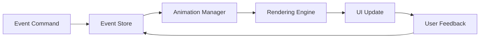

# Cute Figurine Component Architecture

## Overview

The Cute Figurine module is the visual representation layer of Skelly-Jelly, featuring a melty skeleton companion that provides ambient support through subtle animations and state-based expressions. This document details the component architecture, design patterns, and implementation guidelines.

## Component Architecture

### Core Design Principles

1. **Performance First**: Target <2% CPU usage with 15-30 fps animations
2. **Non-Intrusive**: Ambient presence without demanding attention
3. **State-Driven**: Animations reflect user's ADHD state and productivity
4. **Accessibility**: Keyboard navigation, screen reader support, reduced motion options
5. **Cross-Platform**: Consistent experience across macOS, Windows, and Linux

### Technology Stack

- **Framework**: Tauri (Rust backend + WebView frontend)
- **Rendering**: WebGL with Three.js for 3D or Pixi.js for 2D
- **Animation**: Custom skeletal animation system with shader effects
- **State Management**: Zustand or Valtio for reactive state
- **Build System**: Vite + TypeScript
- **Testing**: Vitest + Playwright for visual regression

## Component Structure

```
cute-figurine/
├── src/
│   ├── components/
│   │   ├── SkellyCompanion/
│   │   │   ├── SkellyCompanion.tsx
│   │   │   ├── SkellyCompanion.test.tsx
│   │   │   ├── SkellyCompanion.stories.tsx
│   │   │   └── index.ts
│   │   ├── AnimationEngine/
│   │   │   ├── AnimationEngine.ts
│   │   │   ├── AnimationStates.ts
│   │   │   ├── TransitionManager.ts
│   │   │   └── ShaderEffects.ts
│   │   ├── TextBubble/
│   │   │   ├── TextBubble.tsx
│   │   │   ├── TextBubble.styles.ts
│   │   │   └── MessageQueue.ts
│   │   └── ControlPanel/
│   │       ├── ControlPanel.tsx
│   │       ├── PositionControls.tsx
│   │       └── TransparencySlider.tsx
│   ├── hooks/
│   │   ├── useAnimationFrame.ts
│   │   ├── useWindowPosition.ts
│   │   ├── useDragAndDrop.ts
│   │   └── useAccessibility.ts
│   ├── services/
│   │   ├── EventBusService.ts
│   │   ├── StateManagementService.ts
│   │   ├── RenderingService.ts
│   │   └── StorageService.ts
│   ├── assets/
│   │   ├── sprites/
│   │   ├── shaders/
│   │   └── animations/
│   └── types/
│       ├── AnimationTypes.ts
│       ├── EventTypes.ts
│       └── StateTypes.ts
├── tests/
│   ├── visual/
│   ├── integration/
│   └── performance/
└── BUILD.bazel
```

## Component API Design

### SkellyCompanion Component

```typescript
interface SkellyCompanionProps {
  // Core Properties
  id: string;
  initialState?: CompanionState;
  position?: Position;
  size?: Size;
  
  // Animation Configuration
  animationConfig?: {
    fps: number; // 15-30
    quality: 'low' | 'medium' | 'high';
    enableShaders: boolean;
    reducedMotion: boolean;
  };
  
  // Interaction Handlers
  onStateChange?: (state: CompanionState) => void;
  onInteraction?: (interaction: InteractionEvent) => void;
  onPositionChange?: (position: Position) => void;
  
  // Accessibility
  ariaLabel?: string;
  role?: string;
}

interface CompanionState {
  mood: 'happy' | 'focused' | 'tired' | 'excited' | 'melting';
  activity: 'idle' | 'working' | 'celebrating' | 'resting' | 'thinking';
  energy: number; // 0-100
  meltLevel: number; // 0-100
}
```

### Animation System

```typescript
interface AnimationState {
  name: string;
  duration: number;
  loop: boolean;
  transitions: TransitionConfig[];
  keyframes: Keyframe[];
  shaderParams?: ShaderParameters;
}

interface TransitionConfig {
  to: string;
  duration: number;
  easing: EasingFunction;
  conditions?: TransitionCondition[];
}

class AnimationEngine {
  private states: Map<string, AnimationState>;
  private currentState: string;
  private transitionManager: TransitionManager;
  private shaderEngine: ShaderEngine;
  
  public playAnimation(stateName: string): void;
  public transition(toState: string): Promise<void>;
  public setMeltLevel(level: number): void;
  public update(deltaTime: number): void;
}
```

### Event Bus Integration

```typescript
interface AnimationCommand {
  type: 'play' | 'transition' | 'setMood' | 'setEnergy';
  payload: {
    animation?: string;
    mood?: CompanionState['mood'];
    energy?: number;
    duration?: number;
  };
  metadata: {
    source: string;
    timestamp: number;
    priority: 'low' | 'medium' | 'high';
  };
}

class EventBusService {
  public subscribe(event: 'AnimationCommand', handler: Handler): void;
  public unsubscribe(event: string, handler: Handler): void;
  public emit(event: string, data: any): void;
}
```

## State Management

### Store Architecture

```typescript
interface CompanionStore {
  // State
  companion: CompanionState;
  position: Position;
  settings: CompanionSettings;
  messageQueue: Message[];
  
  // Actions
  updateMood: (mood: CompanionState['mood']) => void;
  updateEnergy: (energy: number) => void;
  setPosition: (position: Position) => void;
  queueMessage: (message: Message) => void;
  processAnimationCommand: (command: AnimationCommand) => void;
  
  // Computed
  currentAnimation: () => AnimationState;
  nextMessage: () => Message | null;
}
```

### State Flow



## Animation States

### Core Animation Sets

1. **Idle States** (2-3 second loops)
   - `idle_breathing`: Gentle expansion/contraction
   - `idle_floating`: Subtle vertical movement
   - `idle_swaying`: Side-to-side motion
   - `idle_blinking`: Eye animations

2. **Activity States**
   - `working_focused`: Minimal movement, steady glow
   - `working_typing`: Subtle hand movements
   - `thinking_scratching`: Head scratch animation
   - `celebrating_bounce`: Happy jumping motion

3. **Mood Transitions**
   - `happy_to_focused`: 500ms smooth transition
   - `focused_to_tired`: 1s gradual slowing
   - `tired_to_melting`: 2s melting effect
   - `melting_to_happy`: 1.5s reformation

4. **Special Effects**
   - `melting_effect`: Shader-based liquification
   - `glow_pulse`: Energy level indication
   - `particle_trail`: Movement particles
   - `rainbow_shimmer`: Celebration effect

### Animation Performance

```typescript
interface PerformanceConfig {
  targetFPS: number;
  adaptiveQuality: boolean;
  maxParticles: number;
  shaderComplexity: 'simple' | 'medium' | 'complex';
  
  // Performance thresholds
  cpuThreshold: number; // Max 2%
  memoryThreshold: number; // Max 50MB
  
  // Degradation strategy
  onPerformanceIssue: (metrics: PerformanceMetrics) => void;
}
```

## Rendering Architecture

### WebGL Pipeline

```typescript
class RenderingEngine {
  private renderer: WebGLRenderer;
  private scene: Scene;
  private camera: Camera;
  private skeleton: SkeletonMesh;
  private shaderManager: ShaderManager;
  
  public initialize(canvas: HTMLCanvasElement): void;
  public render(deltaTime: number): void;
  public updateSkeleton(state: SkeletonState): void;
  public applyShaderEffect(effect: ShaderEffect): void;
  
  // Performance optimization
  public setQuality(quality: RenderQuality): void;
  public enableAdaptivePerformance(): void;
}
```

### Shader System

```glsl
// Melt Effect Vertex Shader
uniform float meltAmount;
uniform float time;

void main() {
  vec3 position = position;
  
  // Apply melting deformation
  float melt = sin(position.y * 3.0 + time) * meltAmount;
  position.x += melt * 0.1;
  position.y -= meltAmount * 0.3 * (1.0 - position.y);
  
  gl_Position = projectionMatrix * modelViewMatrix * vec4(position, 1.0);
}
```

## Interaction System

### User Interactions

```typescript
interface InteractionHandler {
  // Mouse interactions
  onHover(event: MouseEvent): void;
  onClick(event: MouseEvent): void;
  onPet(event: TouchEvent): void;
  
  // Drag and drop
  onDragStart(event: DragEvent): void;
  onDrag(event: DragEvent): void;
  onDragEnd(event: DragEvent): void;
  
  // Keyboard
  onKeyPress(event: KeyboardEvent): void;
  
  // Accessibility
  onFocus(event: FocusEvent): void;
  announceState(state: CompanionState): void;
}
```

### Response Timing

- **Hover Response**: <100ms visual feedback
- **Click Response**: <200ms animation start
- **Pet Response**: <300ms happiness animation
- **State Transition**: 200-500ms smooth blend
- **Message Display**: 100ms fade-in

## Integration Points

### 1. Event Bus Communication

```typescript
// Receiving animation commands
eventBus.subscribe('AnimationCommand', (command: AnimationCommand) => {
  switch (command.type) {
    case 'play':
      animationEngine.playAnimation(command.payload.animation);
      break;
    case 'transition':
      animationEngine.transition(command.payload.animation);
      break;
    case 'setMood':
      store.updateMood(command.payload.mood);
      break;
  }
});
```

### 2. Storage Integration

```typescript
// Persist user preferences
interface StoredPreferences {
  position: Position;
  transparency: number;
  animationQuality: string;
  reducedMotion: boolean;
}

storageService.save('companion-preferences', preferences);
```

### 3. Message Queue System

```typescript
class MessageQueue {
  private queue: Message[] = [];
  private displaying: boolean = false;
  
  public enqueue(message: Message): void;
  public dequeue(): Message | null;
  public display(message: Message): Promise<void>;
  public clear(): void;
}
```

## Accessibility Features

### 1. Screen Reader Support

```typescript
interface AccessibilityConfig {
  announceStateChanges: boolean;
  describeAnimations: boolean;
  keyboardNavigation: boolean;
  highContrastMode: boolean;
}

// ARIA live regions for state changes
<div role="status" aria-live="polite" aria-atomic="true">
  {companionStateDescription}
</div>
```

### 2. Reduced Motion

```typescript
// Respect prefers-reduced-motion
const prefersReducedMotion = window.matchMedia(
  '(prefers-reduced-motion: reduce)'
).matches;

if (prefersReducedMotion) {
  animationConfig.fps = 10;
  animationConfig.enableShaders = false;
  transitionConfig.duration = 0;
}
```

### 3. Keyboard Controls

- **Tab**: Focus companion
- **Enter/Space**: Interact/pet
- **Arrow Keys**: Move position
- **Escape**: Dismiss message
- **H**: Show help tooltip

## Performance Optimization

### 1. Resource Management

```typescript
class ResourceManager {
  private textureCache: Map<string, Texture>;
  private meshCache: Map<string, Mesh>;
  private shaderCache: Map<string, ShaderMaterial>;
  
  public preload(assets: Asset[]): Promise<void>;
  public getTexture(name: string): Texture;
  public disposeMesh(name: string): void;
  public clearUnused(): void;
}
```

### 2. Render Optimization

- **Frustum Culling**: Skip off-screen elements
- **LOD System**: Reduce detail at distance
- **Texture Atlasing**: Combine sprite sheets
- **Instanced Rendering**: Batch similar objects
- **Frame Skipping**: Maintain target FPS

### 3. Memory Management

```typescript
interface MemoryBudget {
  textures: 20; // MB
  meshes: 10; // MB
  animations: 5; // MB
  particles: 2; // MB
  total: 50; // MB target
}
```

## Testing Strategy

### 1. Unit Tests

```typescript
describe('AnimationEngine', () => {
  it('should transition between states smoothly', async () => {
    const engine = new AnimationEngine();
    await engine.transition('idle_to_working');
    expect(engine.currentState).toBe('working');
  });
  
  it('should respect performance constraints', () => {
    const metrics = engine.getPerformanceMetrics();
    expect(metrics.cpu).toBeLessThan(2);
    expect(metrics.memory).toBeLessThan(50);
  });
});
```

### 2. Visual Regression Tests

```typescript
test('companion animations render correctly', async ({ page }) => {
  await page.goto('/companion-test');
  
  // Test each animation state
  for (const state of animationStates) {
    await page.evaluate(`setAnimationState('${state}')`);
    await page.waitForTimeout(500);
    await expect(page).toHaveScreenshot(`${state}.png`);
  }
});
```

### 3. Performance Benchmarks

```typescript
interface PerformanceBenchmark {
  name: string;
  targetFPS: number;
  maxCPU: number;
  maxMemory: number;
  duration: number;
}

const benchmarks: PerformanceBenchmark[] = [
  {
    name: 'idle_animation',
    targetFPS: 30,
    maxCPU: 1,
    maxMemory: 30,
    duration: 60000
  }
];
```

## Implementation Guidelines

### 1. Code Organization

- **Single Responsibility**: Each component has one clear purpose
- **Composition**: Build complex behaviors from simple parts
- **Dependency Injection**: Pass services as props
- **Type Safety**: Full TypeScript coverage

### 2. Animation Best Practices

- **Ease Functions**: Use natural easing curves
- **Anticipation**: Small wind-up before actions
- **Follow-Through**: Overshoot and settle
- **Secondary Motion**: Parts follow main body

### 3. Performance Guidelines

- **Profile First**: Measure before optimizing
- **Budget Resources**: Set limits and stick to them
- **Progressive Enhancement**: Start simple, add features
- **Graceful Degradation**: Handle low-end devices

## Future Enhancements

### Phase 1 (MVP)
- Basic skeleton with 5 animation states
- Simple drag positioning
- Text bubble messages
- WebGL 2D rendering

### Phase 2
- Advanced shader effects
- Particle systems
- More animation states
- Settings panel

### Phase 3
- 3D skeleton option
- Custom skins/themes
- Animation editor
- Community animations

### Phase 4
- Multi-companion support
- Companion interactions
- Advanced AI expressions
- Plugin system

## Conclusion

The Cute Figurine component architecture provides a performant, accessible, and delightful visual companion for ADHD users. By focusing on subtle animations, state-driven behavior, and non-intrusive presence, we create a supportive experience that enhances focus without demanding attention.

The modular architecture ensures maintainability, while the performance-first approach guarantees smooth operation even on modest hardware. With clear integration points and comprehensive testing, the component seamlessly fits into the larger Skelly-Jelly ecosystem.