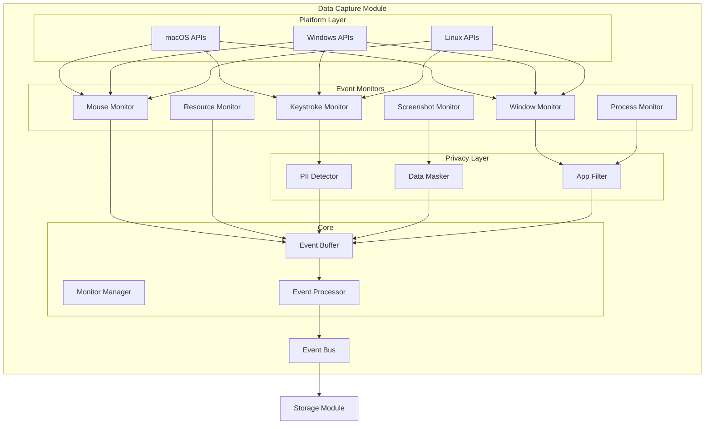
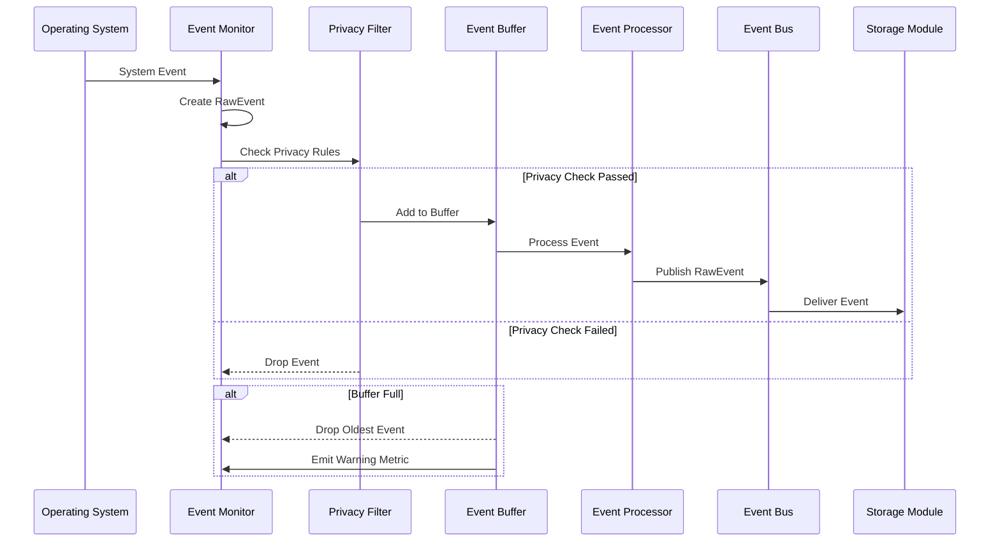
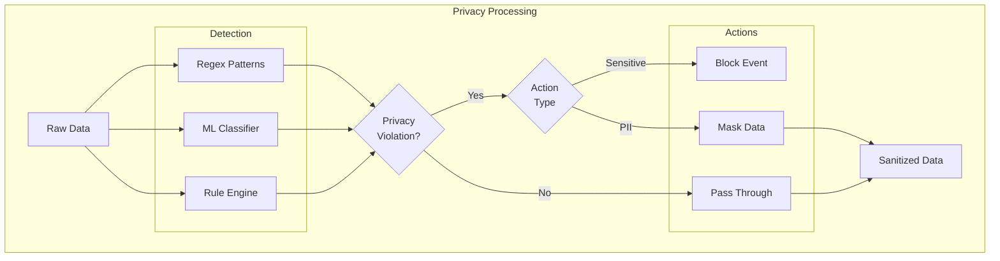
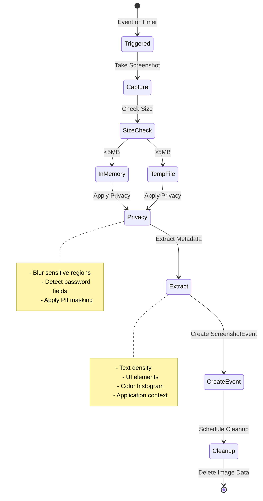
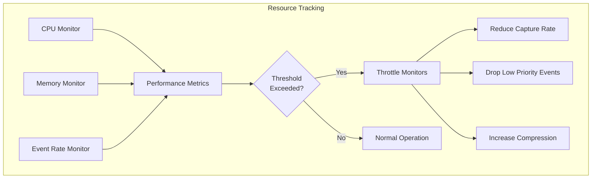
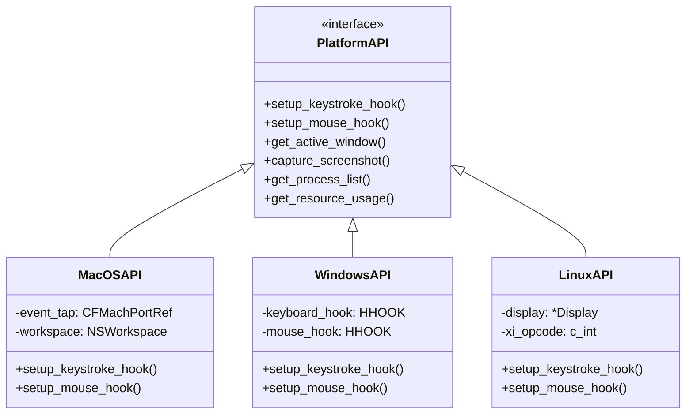
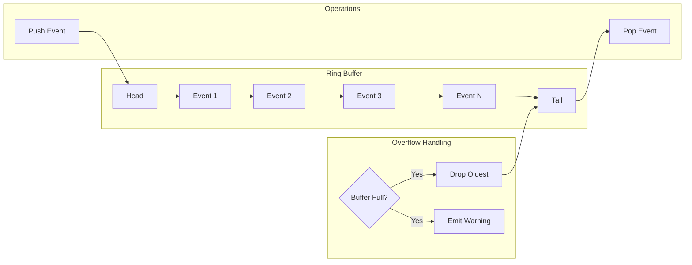
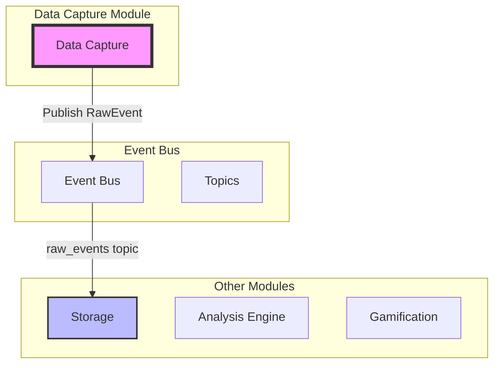
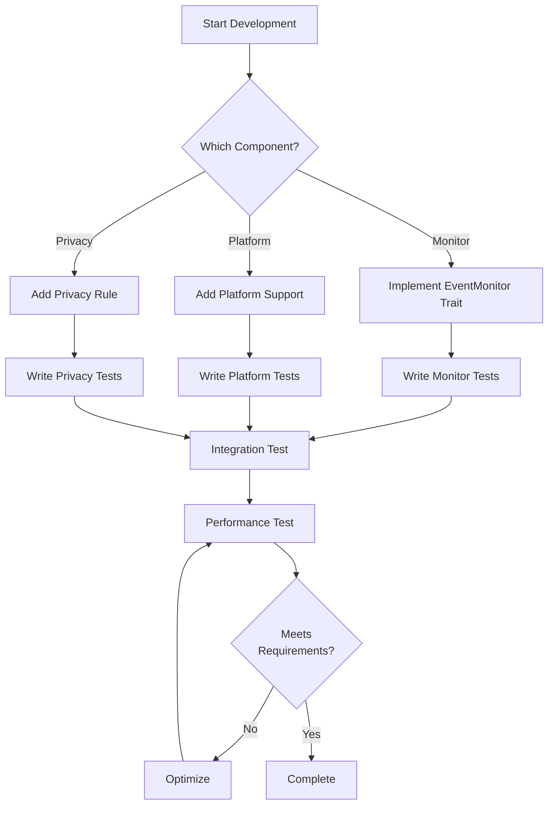

# Data Capture Module - Visual Implementation Guide

## Module Overview



## Event Flow Sequence



## Monitor Architecture

```mermaid
graph LR
    subgraph "Monitor Trait"
        TRAIT[EventMonitor<T>]
        START[start()]
        STOP[stop()]
        EVENTS[events()]
    end
    
    subgraph "Implementations"
        KEYMON[KeystrokeMonitor]
        MOUSEMON[MouseMonitor]
        WINMON[WindowMonitor]
        SCREENMON[ScreenshotMonitor]
        PROCMON[ProcessMonitor]
        RESMON[ResourceMonitor]
    end
    
    TRAIT --> KEYMON
    TRAIT --> MOUSEMON
    TRAIT --> WINMON
    TRAIT --> SCREENMON
    TRAIT --> PROCMON
    TRAIT --> RESMON
```

## Privacy System Flow



## Screenshot Lifecycle



## Performance Monitoring



## Platform Abstraction



## Event Buffer Management



## Integration Points



## Development Workflow

