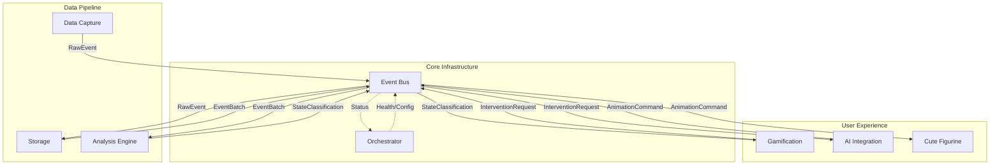

# Skelly-Jelly Integration Specifications

## System Architecture Overview

Skelly-Jelly is a privacy-first, local-only ADHD assistance system with a melty skeleton companion. All modules communicate through a central Event Bus using strongly-typed messages.



## Module Integration Points

### 1. Event Bus Integration

**Central Message Types**
```rust
pub enum BusMessage {
    // Data flow messages
    RawEvent(RawEvent),
    EventBatch(Vec<RawEvent>),
    AnalysisComplete(AnalysisWindow),
    StateChange(StateClassification),
    InterventionRequest(InterventionRequest),
    AnimationCommand(AnimationCommand),
    
    // Control messages
    HealthCheck(HealthCheckRequest),
    HealthStatus(HealthStatus),
    ConfigUpdate(ConfigUpdate),
    Shutdown(ShutdownRequest),
    
    // Error handling
    ModuleError(ModuleError),
    RecoveryAttempt(RecoveryInfo),
}
```

**Module Registration**
```rust
// Each module registers on startup
let registration = ModuleRegistration {
    id: ModuleId::DataCapture,
    version: "1.0.0",
    subscriptions: vec![
        MessageTopic::ConfigUpdate,
        MessageTopic::Shutdown,
    ],
    publishes: vec![
        MessageTopic::RawEvent,
    ],
    health_endpoint: "http://localhost:8001/health",
};

event_bus.register_module(registration).await?;
```

### 2. Data Flow Integration

**Data Capture → Storage**
```rust
// Data Capture publishes events
let event = RawEvent {
    timestamp: SystemTime::now(),
    session_id: current_session,
    event_type: EventType::Keystroke(keystroke_data),
};
event_bus.publish(BusMessage::RawEvent(event)).await?;

// Storage subscribes and batches
storage_module.on_event(|event: RawEvent| {
    batch_manager.add_event(event);
    if batch_manager.should_flush() {
        let batch = batch_manager.create_batch();
        event_bus.publish(BusMessage::EventBatch(batch)).await?;
    }
});
```

**Storage → Analysis Engine**
```rust
// Storage publishes batches every 30 seconds
let batch = EventBatch {
    window_start: start_time,
    window_end: end_time,
    events: collected_events,
    session_id: current_session,
};
event_bus.publish(BusMessage::EventBatch(batch)).await?;

// Analysis Engine processes batches
analysis_engine.on_batch(|batch: EventBatch| {
    let features = extract_features(&batch);
    let state = classify_state(&features);
    event_bus.publish(BusMessage::StateChange(state)).await?;
});
```

**Analysis Engine → Gamification**
```rust
// Analysis Engine publishes state changes
let classification = StateClassification {
    state: ADHDState::Distracted,
    confidence: 0.85,
    timestamp: SystemTime::now(),
    contributing_factors: vec![
        "high_window_switching",
        "irregular_typing_pattern",
    ],
};
event_bus.publish(BusMessage::StateChange(classification)).await?;

// Gamification decides on interventions
gamification.on_state_change(|state: StateClassification| {
    if should_intervene(&state, &last_intervention_time) {
        let request = create_intervention_request(&state);
        event_bus.publish(BusMessage::InterventionRequest(request)).await?;
    }
});
```

**Gamification → AI Integration**
```rust
// Gamification requests intervention
let request = InterventionRequest {
    trigger_state: ADHDState::Distracted,
    intervention_type: InterventionType::GentleNudge,
    context: InterventionContext {
        work_type: WorkType::Coding,
        duration_in_state: Duration::from_mins(15),
        recent_progress: progress_metrics,
    },
};
event_bus.publish(BusMessage::InterventionRequest(request)).await?;

// AI Integration generates response
ai_integration.on_intervention_request(|request: InterventionRequest| {
    let response = generate_intervention(&request).await?;
    let command = AnimationCommand {
        animation: "gentle_wave",
        message: response.message,
        duration: Duration::from_secs(5),
    };
    event_bus.publish(BusMessage::AnimationCommand(command)).await?;
});
```

### 3. Screenshot Lifecycle Management

**Special handling for privacy and memory efficiency**

```rust
// Data Capture creates screenshot event
let screenshot = ScreenshotEvent {
    id: Uuid::new_v4(),
    timestamp: SystemTime::now(),
    size_bytes: image_data.len(),
    data: if image_data.len() < 5_000_000 {
        ScreenshotData::InMemory(image_data)
    } else {
        ScreenshotData::TempFile(save_temp_file(image_data)?)
    },
};

// Storage manages lifecycle
storage.on_screenshot(|screenshot: ScreenshotEvent| {
    // Store metadata immediately
    db.insert_screenshot_metadata(&screenshot.metadata());
    
    // Queue for analysis
    analysis_queue.push(screenshot.id);
    
    // Schedule deletion after analysis window
    scheduler.schedule(
        Duration::from_secs(30),
        move || delete_screenshot(screenshot.id)
    );
});

// Analysis Engine extracts features
analysis_engine.on_screenshot(|screenshot: ScreenshotEvent| {
    let features = extract_screenshot_features(&screenshot);
    // Original image data deleted, only features retained
    storage.mark_screenshot_analyzed(screenshot.id);
});
```

### 4. Health Monitoring Integration

**Orchestrator monitors all modules**

```rust
// Orchestrator sends periodic health checks
orchestrator.health_monitor(|modules: Vec<ModuleId>| {
    for module in modules {
        let request = HealthCheckRequest {
            module_id: module,
            timestamp: SystemTime::now(),
        };
        event_bus.publish(BusMessage::HealthCheck(request)).await?;
    }
});

// Modules respond with health status
module.on_health_check(|request: HealthCheckRequest| {
    let status = HealthStatus {
        module_id: self.id,
        status: if self.is_healthy() { 
            ModuleStatus::Healthy 
        } else { 
            ModuleStatus::Degraded 
        },
        metrics: self.get_metrics(),
    };
    event_bus.publish(BusMessage::HealthStatus(status)).await?;
});

// Orchestrator handles failures
orchestrator.on_health_status(|status: HealthStatus| {
    if status.is_unhealthy() {
        attempt_recovery(status.module_id).await?;
    }
});
```

### 5. Configuration Management

**Centralized configuration with hot reloading**

```rust
// Orchestrator loads and validates configuration
let config = load_config("config.toml")?;
validate_config(&config)?;

// Broadcast configuration updates
let update = ConfigUpdate {
    module_id: Some(ModuleId::Gamification),
    changes: hashmap! {
        "intervention_cooldown_ms" => Value::Number(900_000), // 15 minutes
        "reward_frequency" => Value::String("variable_ratio"),
    },
};
event_bus.publish(BusMessage::ConfigUpdate(update)).await?;

// Modules apply configuration
module.on_config_update(|update: ConfigUpdate| {
    if update.applies_to(self.id) {
        self.apply_config(update.changes)?;
        log::info!("Configuration updated: {:?}", update.changes);
    }
});
```

### 6. Error Handling and Recovery

**Graceful error propagation and recovery**

```rust
// Modules report errors
let error = ModuleError {
    module_id: ModuleId::AnalysisEngine,
    error_type: ErrorType::InferenceFailure,
    message: "Model inference timeout",
    severity: Severity::Warning,
    context: error_context,
};
event_bus.publish(BusMessage::ModuleError(error)).await?;

// Orchestrator coordinates recovery
orchestrator.on_module_error(|error: ModuleError| {
    match error.severity {
        Severity::Critical => {
            // Restart module
            restart_module(error.module_id).await?;
        }
        Severity::Warning => {
            // Log and monitor
            metrics.record_error(&error);
            if error_rate_exceeds_threshold() {
                trigger_degraded_mode(error.module_id);
            }
        }
        Severity::Info => {
            // Just log
            log::info!("Module {} reported: {}", error.module_id, error.message);
        }
    }
});
```

## Performance Specifications

### Message Throughput
- **Target**: 1000+ messages/second
- **Latency**: <1ms for high-priority messages
- **Batching**: Automatic for high-frequency events

### Resource Limits
```yaml
modules:
  data_capture:
    cpu_limit: 5%
    memory_limit: 50MB
    
  storage:
    cpu_limit: 10%
    memory_limit: 200MB
    disk_limit: 1GB
    
  analysis_engine:
    cpu_limit: 20%
    memory_limit: 500MB
    
  gamification:
    cpu_limit: 5%
    memory_limit: 100MB
    
  ai_integration:
    cpu_limit: 30%
    memory_limit: 4GB  # For local LLM
    
  cute_figurine:
    cpu_limit: 10%
    memory_limit: 200MB
```

## Security and Privacy

### Data Protection
- **Encryption**: Optional AES-256 for sensitive fields
- **PII Masking**: Automatic in screenshots and text
- **Local Only**: No external communication except AI fallback
- **Data Retention**: Configurable with automatic cleanup

### Access Control
```rust
// Module capabilities
enum Capability {
    PublishRawEvents,
    ReadAnalysisResults,
    TriggerInterventions,
    AccessConfiguration,
    ManageLifecycle,
}

// Enforce at Event Bus level
event_bus.authorize(module_id, capability)?;
```

## Testing Strategy

### Integration Tests
```rust
#[tokio::test]
async fn test_full_event_flow() {
    // Start test event bus
    let event_bus = create_test_bus();
    
    // Create mock modules
    let mut data_capture = MockDataCapture::new();
    let mut storage = MockStorage::new();
    let mut analysis = MockAnalysisEngine::new();
    
    // Register modules
    event_bus.register(data_capture.registration()).await?;
    event_bus.register(storage.registration()).await?;
    event_bus.register(analysis.registration()).await?;
    
    // Simulate event flow
    data_capture.emit_keystroke_event();
    
    // Verify event propagation
    tokio::time::sleep(Duration::from_millis(100)).await;
    assert!(storage.received_event());
    assert!(analysis.received_batch());
}
```

### Contract Testing
```yaml
# contracts/storage-analysis.yaml
contract:
  producer: storage
  consumer: analysis_engine
  message: EventBatch
  
  schema:
    type: object
    required: [window_start, window_end, events]
    properties:
      window_start:
        type: string
        format: date-time
      window_end:
        type: string
        format: date-time
      events:
        type: array
        items:
          $ref: "#/definitions/RawEvent"
```

## Deployment Configuration

### Module Startup Order
1. Event Bus (core infrastructure)
2. Orchestrator (lifecycle management)
3. Storage (data persistence)
4. Data Capture (event generation)
5. Analysis Engine (state detection)
6. Gamification (intervention logic)
7. AI Integration (assistance generation)
8. Cute Figurine (UI presentation)

### Graceful Shutdown
```rust
// Orchestrator initiates shutdown
orchestrator.shutdown(|modules: Vec<ModuleId>| {
    // Reverse order shutdown
    for module in modules.iter().rev() {
        event_bus.publish(BusMessage::Shutdown(ShutdownRequest {
            module_id: *module,
            timeout: Duration::from_secs(30),
            save_state: true,
        })).await?;
    }
});

// Modules handle shutdown
module.on_shutdown(|request: ShutdownRequest| {
    // Save state
    self.persist_state().await?;
    
    // Cleanup resources
    self.cleanup().await?;
    
    // Acknowledge shutdown
    event_bus.publish(BusMessage::ShutdownComplete(self.id)).await?;
});
```

## Monitoring and Observability

### Metrics Collection
```rust
// Each module exposes metrics
let metrics = ModuleMetrics {
    messages_processed: counter.value(),
    processing_time_p99: histogram.percentile(0.99),
    error_rate: error_counter.rate(),
    custom_metrics: module_specific_metrics,
};

// Aggregated by Orchestrator
orchestrator.collect_metrics(|all_metrics: HashMap<ModuleId, ModuleMetrics>| {
    // Log to file for local analysis
    metrics_logger.log(&all_metrics);
    
    // Update dashboard if running
    if let Some(dashboard) = dashboard_sink {
        dashboard.update(all_metrics);
    }
});
```

### Debug Mode
```toml
[debug]
enabled = true
log_level = "debug"
save_messages = true  # Save all bus messages for replay
message_trace = true  # Track message flow through system
performance_profiling = true
```

This integration specification ensures all modules work together seamlessly while maintaining privacy, performance, and reliability requirements.