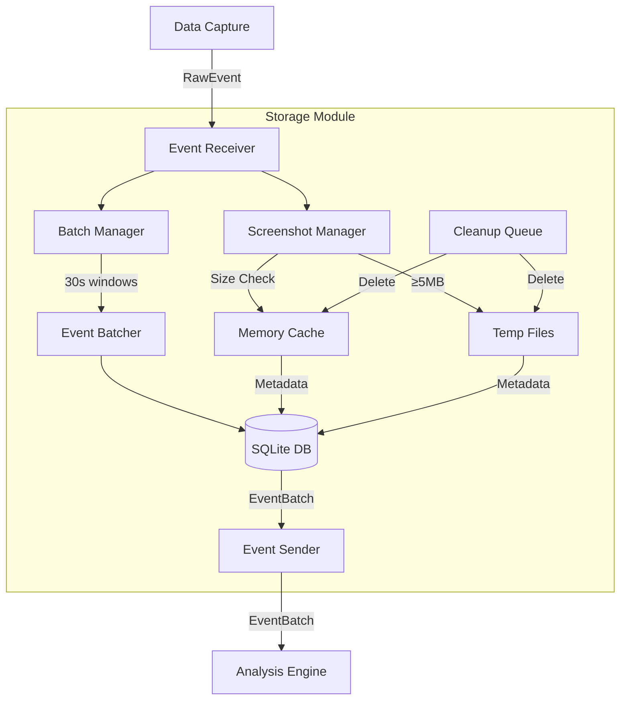

# Storage Module Design Specification

## Overview
The Storage Module is the critical data management layer in Skelly-Jelly, responsible for receiving all raw events from the Data Capture module, managing screenshot lifecycles, batching events for analysis, and ensuring privacy through automatic cleanup. It serves as the high-performance buffer between real-time event capture and batch analysis processing.

## Module Responsibilities

### Primary Functions
1. **Event Reception**: Receive all RawEvent types from Data Capture via Event Bus
2. **Event Batching**: Group events into 30-second analysis windows
3. **Screenshot Management**: Handle in-memory vs. file storage based on size
4. **Data Persistence**: Store event metadata permanently in time-series optimized database
5. **Lifecycle Management**: Automatic cleanup of temporary data (screenshots)
6. **Performance Optimization**: Maintain <2% CPU usage while handling 1000+ events/second

### Event Flow
```
Data Capture → RawEvent → Storage → EventBatch → Analysis Engine
                            ↓
                      Screenshot Lifecycle
                      (Capture → Store → Delete)
```

## Architecture

### Component Design

```rust
// Core module structure
pub struct StorageModule {
    event_receiver: EventReceiver,
    batch_manager: BatchManager,
    screenshot_manager: ScreenshotManager,
    database: TimeSeriesDatabase,
    metrics: PerformanceMetrics,
}

// Event batching component
pub struct BatchManager {
    current_window: EventWindow,
    window_duration: Duration, // 30 seconds
    batch_buffer: VecDeque<RawEvent>,
    batch_sender: EventSender<EventBatch>,
}

// Screenshot lifecycle management
pub struct ScreenshotManager {
    memory_cache: LruCache<ScreenshotId, Vec<u8>>,
    temp_storage: TempFileManager,
    size_threshold: usize, // 5MB
    cleanup_queue: PriorityQueue<ScreenshotId, Instant>,
}

// Time-series optimized database
pub struct TimeSeriesDatabase {
    connection_pool: SqlitePool,
    write_buffer: WriteBuffer,
    compaction_scheduler: CompactionScheduler,
}
```

### Data Flow Architecture



## Detailed Component Specifications

### 1. Event Receiver

**Purpose**: High-performance event ingestion from Event Bus

**Implementation**:
```rust
impl EventReceiver {
    pub async fn receive_events(&mut self) -> Result<()> {
        while let Some(event) = self.bus_receiver.recv().await {
            match event {
                BusMessage::RawEvent(raw_event) => {
                    self.process_raw_event(raw_event).await?;
                }
                BusMessage::Shutdown(_) => break,
                _ => {} // Ignore non-relevant messages
            }
        }
        Ok(())
    }
    
    async fn process_raw_event(&mut self, event: RawEvent) -> Result<()> {
        // Route to appropriate handler
        match &event {
            RawEvent::Screenshot(screenshot) => {
                self.screenshot_manager.handle(screenshot).await?;
            }
            _ => {
                self.batch_manager.add_event(event).await?;
            }
        }
        
        self.metrics.record_event_received();
        Ok(())
    }
}
```

**Performance Requirements**:
- < 1ms processing latency per event
- Zero-copy where possible
- Backpressure handling for bursts

### 2. Batch Manager

**Purpose**: Aggregate events into fixed-duration windows for analysis

**Implementation**:
```rust
pub struct EventWindow {
    window_id: Uuid,
    start_time: Instant,
    end_time: Instant,
    events: Vec<RawEvent>,
    screenshot_refs: Vec<ScreenshotId>,
}

impl BatchManager {
    pub async fn add_event(&mut self, event: RawEvent) -> Result<()> {
        let now = Instant::now();
        
        // Check if we need to close current window
        if now.duration_since(self.current_window.start_time) >= self.window_duration {
            self.close_window().await?;
        }
        
        // Add event to current window
        self.current_window.events.push(event);
        
        // Update metrics
        self.metrics.events_in_window = self.current_window.events.len();
        
        Ok(())
    }
    
    async fn close_window(&mut self) -> Result<()> {
        // Create batch from current window
        let batch = EventBatch {
            window_id: self.current_window.window_id,
            start_time: self.current_window.start_time,
            end_time: Instant::now(),
            events: std::mem::take(&mut self.current_window.events),
            screenshot_refs: std::mem::take(&mut self.current_window.screenshot_refs),
        };
        
        // Send to Analysis Engine
        self.batch_sender.send(BusMessage::EventBatch(batch)).await?;
        
        // Create new window
        self.current_window = EventWindow::new();
        
        Ok(())
    }
}
```

**Batching Strategy**:
- 30-second fixed windows
- Immediate forwarding on window close
- Maximum 10,000 events per batch (safety limit)

### 3. Screenshot Manager

**Purpose**: Efficient screenshot storage with automatic lifecycle management

**Implementation**:
```rust
impl ScreenshotManager {
    pub async fn handle(&mut self, screenshot: &ScreenshotEvent) -> Result<ScreenshotId> {
        let id = ScreenshotId::new();
        let size = screenshot.data.len();
        
        // Store based on size
        if size < self.size_threshold {
            // Keep in memory
            self.memory_cache.put(id.clone(), screenshot.data.clone());
            self.metrics.screenshots_in_memory += 1;
        } else {
            // Write to temp file
            let path = self.temp_storage.create_file(&id, &screenshot.data).await?;
            self.metrics.screenshots_on_disk += 1;
        }
        
        // Extract and store metadata immediately
        let metadata = self.extract_metadata(screenshot).await?;
        self.database.store_screenshot_metadata(&id, &metadata).await?;
        
        // Schedule for deletion after 30 seconds
        let delete_time = Instant::now() + Duration::from_secs(30);
        self.cleanup_queue.push(id.clone(), delete_time);
        
        Ok(id)
    }
    
    async fn extract_metadata(&self, screenshot: &ScreenshotEvent) -> Result<ScreenshotMetadata> {
        Ok(ScreenshotMetadata {
            timestamp: screenshot.timestamp,
            window_title: screenshot.window_title.clone(),
            app_name: screenshot.app_name.clone(),
            screen_region: screenshot.region,
            text_density: calculate_text_density(&screenshot.data),
            dominant_colors: extract_dominant_colors(&screenshot.data, 5),
            ui_element_count: detect_ui_elements(&screenshot.data),
            privacy_masked: screenshot.privacy_masked,
        })
    }
    
    pub async fn cleanup_expired(&mut self) -> Result<()> {
        let now = Instant::now();
        
        while let Some((id, delete_time)) = self.cleanup_queue.peek() {
            if *delete_time > now {
                break; // No more expired screenshots
            }
            
            // Remove from storage
            if self.memory_cache.contains(&id) {
                self.memory_cache.pop(&id);
                self.metrics.screenshots_in_memory -= 1;
            } else {
                self.temp_storage.delete_file(&id).await?;
                self.metrics.screenshots_on_disk -= 1;
            }
            
            self.cleanup_queue.pop();
            self.metrics.screenshots_deleted += 1;
        }
        
        Ok(())
    }
}
```

**Storage Rules**:
- < 5MB: Memory cache (LRU with 50 screenshot capacity)
- ≥ 5MB: Temp file with immediate metadata extraction
- 30-second retention for all screenshots
- Dev mode: Keep last 5 screenshots for debugging

### 4. Time-Series Database

**Purpose**: Optimized storage for behavioral event data

**Schema Design**:
```sql
-- Event storage (append-only)
CREATE TABLE events (
    timestamp BIGINT NOT NULL,
    session_id BLOB NOT NULL,
    event_type INTEGER NOT NULL,
    data BLOB NOT NULL, -- Compressed Protocol Buffer
    PRIMARY KEY (timestamp, session_id)
) WITHOUT ROWID;

-- Time-based partitioning
CREATE TABLE events_2024_01 PARTITION OF events
    FOR VALUES FROM ('2024-01-01') TO ('2024-02-01');

-- Screenshot metadata (permanent storage)
CREATE TABLE screenshot_metadata (
    screenshot_id BLOB PRIMARY KEY,
    timestamp BIGINT NOT NULL,
    window_title TEXT,
    app_name TEXT,
    text_density REAL,
    ui_element_count INTEGER,
    dominant_colors BLOB, -- JSON array
    privacy_masked BOOLEAN
);

-- Aggregation tables
CREATE TABLE event_aggregates_minute (
    timestamp BIGINT PRIMARY KEY,
    keystroke_count INTEGER,
    mouse_clicks INTEGER,
    window_switches INTEGER,
    active_time_ms INTEGER,
    screenshot_count INTEGER
);

-- Indexes for common queries
CREATE INDEX idx_events_session ON events(session_id, timestamp);
CREATE INDEX idx_screenshots_timestamp ON screenshot_metadata(timestamp);
```

**Optimization Strategies**:
- Write batching with 1-second buffers
- LZ4 compression for event data
- Automatic hourly/daily rollups
- Vacuum scheduling during low activity

### 5. Performance Metrics

**Purpose**: Real-time monitoring of storage performance

**Tracked Metrics**:
```rust
pub struct PerformanceMetrics {
    // Event metrics
    events_received: AtomicU64,
    events_per_second: ExponentialMovingAverage,
    event_processing_latency: Histogram,
    
    // Batch metrics
    batches_created: AtomicU64,
    events_per_batch: RollingAverage,
    batch_creation_time: Histogram,
    
    // Screenshot metrics
    screenshots_received: AtomicU64,
    screenshots_in_memory: AtomicU32,
    screenshots_on_disk: AtomicU32,
    screenshots_deleted: AtomicU64,
    screenshot_processing_time: Histogram,
    
    // Database metrics
    db_write_latency: Histogram,
    db_write_batch_size: RollingAverage,
    db_size_bytes: AtomicU64,
    
    // Resource usage
    memory_usage_bytes: AtomicU64,
    cpu_usage_percent: ExponentialMovingAverage,
}
```

## Interface Definitions

### Input Interface (from Data Capture)

```rust
pub enum RawEvent {
    Keystroke(KeystrokeEvent),
    MouseMove(MouseMoveEvent),
    MouseClick(MouseClickEvent),
    WindowFocus(WindowFocusEvent),
    Screenshot(ScreenshotEvent),
    ProcessStart(ProcessEvent),
    ResourceUsage(ResourceEvent),
}

pub struct ScreenshotEvent {
    pub timestamp: Instant,
    pub screenshot_id: ScreenshotId,
    pub data: Vec<u8>, // Raw image data
    pub format: ImageFormat,
    pub window_title: String,
    pub app_name: String,
    pub region: ScreenRegion,
    pub privacy_masked: bool,
}
```

### Output Interface (to Analysis Engine)

```rust
pub struct EventBatch {
    pub window_id: Uuid,
    pub start_time: Instant,
    pub end_time: Instant,
    pub events: Vec<RawEvent>,
    pub screenshot_refs: Vec<ScreenshotId>,
}

// Sent via Event Bus
BusMessage::EventBatch(EventBatch)
```

## Error Handling

### Strategy
- **Graceful Degradation**: Continue operation even if individual components fail
- **Circuit Breakers**: Prevent cascading failures
- **Error Recovery**: Automatic retry with exponential backoff

### Error Types
```rust
#[derive(Error, Debug)]
pub enum StorageError {
    #[error("Database error: {0}")]
    Database(#[from] sqlx::Error),
    
    #[error("Screenshot storage error: {0}")]
    ScreenshotStorage(String),
    
    #[error("Event bus error: {0}")]
    EventBus(#[from] BusError),
    
    #[error("Resource exhaustion: {0}")]
    ResourceExhaustion(String),
}
```

## Configuration

```toml
[storage]
# Batching configuration
batch_window_seconds = 30
max_events_per_batch = 10000

# Screenshot management
screenshot_memory_threshold_mb = 5
screenshot_retention_seconds = 30
screenshot_memory_cache_size = 50
dev_mode_screenshot_count = 5

# Database configuration
database_path = "~/.skelly-jelly/events.db"
database_pool_size = 4
write_buffer_size_mb = 10
compaction_interval_hours = 24

# Performance limits
max_memory_usage_mb = 100
target_cpu_usage_percent = 2

# Retention policy
raw_events_retention_days = 7
hourly_aggregates_retention_days = 30
daily_summaries_retention_days = 365
```

## Testing Strategy

### Unit Tests
- Event batching logic with various timing scenarios
- Screenshot size threshold handling
- Database write performance under load
- Cleanup queue operation

### Integration Tests
- End-to-end event flow from reception to batch emission
- Screenshot lifecycle from storage to deletion
- Database schema migrations
- Performance under sustained load

### Performance Tests
```rust
#[bench]
fn bench_event_ingestion() {
    // Target: 1000+ events/second
}

#[bench]
fn bench_batch_creation() {
    // Target: <10ms for 30-second window
}

#[bench]
fn bench_screenshot_processing() {
    // Target: <50ms for 5MB image
}
```

## Security Considerations

### Data Protection
- Optional AES-256 encryption for sensitive fields
- Automatic PII detection and masking in screenshots
- Secure deletion of temporary files

### Access Control
- Read-only access for Analysis Engine
- No external network access
- File permissions: 600 for database and temp files

## Implementation Guidelines

### Development Phases

1. **Phase 1: Core Event Storage**
   - Basic event reception and database storage
   - Simple batching without optimization

2. **Phase 2: Screenshot Management**
   - Size-based storage routing
   - Lifecycle management with cleanup

3. **Phase 3: Performance Optimization**
   - Write batching and compression
   - Memory management and caching

4. **Phase 4: Advanced Features**
   - Aggregation tables and rollups
   - Dev mode debugging features

### Code Organization
```
modules/storage/
├── src/
│   ├── lib.rs              # Module entry point
│   ├── receiver.rs         # Event reception
│   ├── batch_manager.rs    # Batching logic
│   ├── screenshot.rs       # Screenshot management
│   ├── database.rs         # Database operations
│   ├── metrics.rs          # Performance tracking
│   └── error.rs            # Error types
├── tests/
│   ├── unit/
│   ├── integration/
│   └── benchmarks/
└── BUILD.bazel
```

### Best Practices
- Use async/await for all I/O operations
- Implement backpressure handling
- Monitor resource usage continuously
- Profile regularly to maintain performance targets
- Document all public APIs thoroughly

## Future Enhancements

### Planned Features
- Distributed storage for multi-device sync
- Advanced compression algorithms (Zstd)
- Real-time replication for backup
- GraphQL API for historical queries

### Scalability Considerations
- Horizontal partitioning by time range
- Read replicas for analysis queries
- Columnar storage for aggregates
- GPU acceleration for screenshot processing